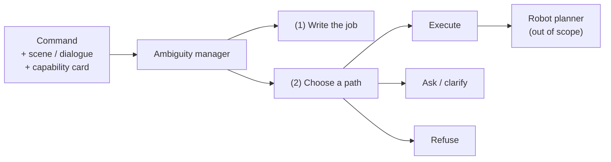

# Abstract

Robots that follow spoken or typed English still fail when a command is **compound and ambiguous**: several unknowns sit in one sentence, and the appropriate next action is not always execution. Clarification or refusal may be required. This report studies a text-only ambiguity manager that precedes any robot planner. The manager must (1) produce a written statement of the intended job and (2) select a handling path among execute, clarify, and refuse.

*Figure A. Scope of the text layer. Embodied planning is excluded.*

Six systems are evaluated on **Pilot-120**, a fixed set of 120 compound commands with gold labels. The study’s default decoding temperature is **0.7**. An additional temperature study compares **0.0, 0.3, 0.7, and 1.0** with matched replicas. Full system tables at temperature 0.7 are marked **[Results Incoming]** where the sweep is still finishing; completed comparable counts below are from the finished temperature-0 matched set and are labelled as such.

| # | System | Description |
|---:|---|---|
| 1 | Raw Qwen | Base model selects the route |
| 2 | Fine-tune | Same prompt with a parameter-efficient adapter; no manager |
| 3 | New goal-first | Short intent summary; deterministic Python router |
| 4 | New degree | Shared analysis with goal-first; uncertainty thresholds; never refuses |
| 5 | New timid | Shared analysis with goal-first; ask-unless-clean policy |
| 6 | New context-blind | Same router; scene and capability card withheld |

**Primary outcome.** Intent correctness: whether the written job matches gold.  
**Official intent protocol.** Two independent judges, blinded to the route, both must agree that the text names the gold job.  
**Automatic overlap check.** A lexical content-word overlap rule (threshold 0.18) used as a fast automatic screen; it is **not** the final intent verdict when two-judge scores exist.  
**Secondary outcomes.** Routing correctness and supporting metrics (ambiguity, clarification, risk-sensitive decision accuracy, slot binding).

| Exam | Raw Qwen | New goal-first |
|---|---:|---:|
| **Two-judge intent (official)** | **113 / 120** (`intent_summary` box) | **113 / 120** (`intent_summary`) |
| Automatic overlap (screen, same field) | **120 / 120** (`intent_summary`) | 112 / 120 (`intent_summary`) |
| Routing correctness | **88 / 120** | 54 / 120 |
| Risk-sensitive decision **accuracy** (53 medium+high) | **0.736** | 0.491 |
| Low-risk routing (64 low) | **46 / 64** | 27 / 64 |

The two-judge row is the primary intent result. Once every comparator emits a dedicated job box, automatic overlap is scored only on `intent_summary` (raw **120 / 120**, goal-first **112 / 120**). An older reasoning-field screen (68 / 60) is dropped: it was a temporary gauge before intent boxes existed and must not be compared to box scores. Official two-judge is **tied** at 113 / 120 (disjoint miss lists). H1’s claim that write-then-route names the job *more often* than raw is therefore **not supported** on the official protocol.

Routing remains weaker than raw Qwen on the completed temperature-0 set. Of 120 rows, 62 show correct automatic-overlap intent with incorrect routing (46 refuse, 13 ask, 3 execute). Low-stakes rows are not ignored: on the 64 gold-low rows, goal-first routing is only **27 / 64** versus raw **46 / 64**. The dominant mechanism is a refuse-first router that trusts miscalibrated capability and safety fields rather than the intent paragraph.

| Supporting metric          |       Raw | Goal-first | Status                                     |
| -------------------------- | --------: | ---------: | ------------------------------------------ |
| Ask-label F1               | **0.557** |      0.286 | Scored                                     |
| Clarification wording / 23 |    0 / 23 |     0 / 23 | **[FIXABLE]** (not awaiting the GPU sweep) |
| Slot-binding CPC F1        |         — |      0.045 | **[FIXABLE]** (not awaiting the GPU sweep) |
| Ambiguity exact-set        |   0 / 120 |    0 / 120 | Frozen emit; **fix queued** (job 54774)   |

Wording and CPC failures come from empty `candidate_interpretations` and incorrect CPC status stamps on **already frozen** predictions. They are CPU-scored sidecar defects, not unfinished GPU work, and they do not overturn the official intent result.

**Contribution.** The study documents an intent–policy dissociation: write-then-route generation can produce strong official intent writing while a brittle capability- and safety-driven router still selects the wrong handling path. Improving that router, completing the temperature-0.7-centred scoreboard (H3 lower temperature; H4 higher temperature), and re-emitting wording/CPC fields are listed as follow-on work.

**Keywords:** robot command understanding; intent correctness; ambiguity management; clarification; risk-aware routing; Pilot-120.
