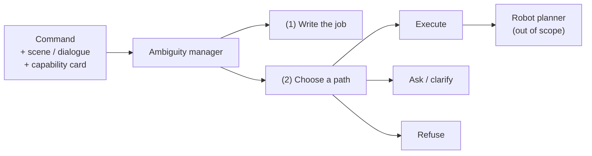

# Abstract

Robots that follow spoken or typed English still fail when a command is **compound and ambiguous**: several unknowns sit in one sentence, and the right next move is not always “do the job.” Sometimes the safe move is to ask; sometimes it is to refuse politely.

This report studies a **text-only** ambiguity manager that sits in front of any robot planner. It must (1) write the job it thinks the person meant, and (2) choose **execute**, **ask**, or **refuse**.

*Figure A. Text layer under study. Physical planning is out of scope.*

## What we evaluated

Six systems on **Pilot-120** (120 compound commands with gold labels), matching the proposal’s comparison shape: direct LLM, fine-tune, full write-then-route manager, degree policy, conservative ask policy, and context-blind control.

|   # | System            | In one line                                        |
| --: | ----------------- | -------------------------------------------------- |
|   1 | Raw Qwen          | Base model chooses the route itself                |
|   2 | Fine-tune         | Same prompt + small adapter; still no manager      |
|   3 | New goal-first    | Writes a short job box; Python picks the route     |
|   4 | New degree        | Same writing; uncertainty rule; never refuses      |
|   5 | New timid         | Same writing; asks unless the analysis looks clean |
|   6 | New context-blind | Same router; scene and capability card hidden      |

## Main finding (routing first)

Relative to the proposal’s primary outcome — **routing** — the live risk-aware manager does **not** beat raw Qwen on Pilot-120.

| Exam                              |                        Raw Qwen |             New goal-first | Who wins?     |
| --------------------------------- | ------------------------------: | -------------------------: | ------------- |
| Routing correctness               |                    **88 / 120** |                   54 / 120 | Raw           |
| Risk-sensitive (53 med+high rows) |                       **0.736** |                      0.491 | Raw           |
| Cheap intent (word overlap)       | 68 / 120 *(old reasoning text)* |  **112 / 120** *(job box)* | Goal-first*   |
| Official two-judge intent         |   **113 / 120** *(new job box)* | **113 / 120** *(same box)* | Tie on count* |

\*Do **not** subtract 112 from 68, or treat the two 113s as the same rows — different text fields / different misses.

| Why routing fell | Plain reading |
|---|---|
| **62** rows: intent yes, routing no | Writing named the job; button still missed |
| Of those 62 | **46** refuse · **13** ask · **3** wrong execute |
| Main cause | Wrong capability / “unsafe” bits triggered refuse |

## Supporting scores (short)

| Metric | Raw | Goal-first | Status |
|---|---:|---:|---|
| Ask-label F1 (pressed Ask?) | **0.557** | 0.286 | Live |
| Clarification wording / 23 | 0 / 23 | 0 / 23 | **[FIXABLE]** |
| Slot-binding (CPC) F1 | — | 0.045 | **[FIXABLE]** |
| Ambiguity exact-set | 0 / 120 | 0 / 120 | **[LIMITATION]** |

## Contribution

Separating “did we understand?” from “did we press the right button?” is essential. A write-then-route design can produce strong intent writing while a brittle capability/safety router still destroys routing. Fixable generator bugs are marked so secondary zeros are not over-read as empty science.

**Keywords:** robot command understanding; ambiguity management; clarification; risk-aware routing; large language models; Pilot-120.
