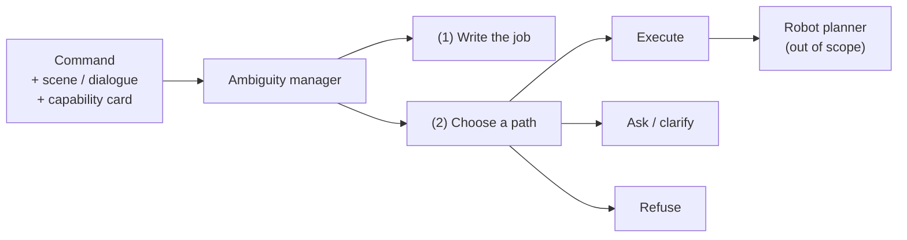

# Abstract

Robots that follow spoken or typed English still fail when a command is **compound and ambiguous**: several unknowns sit in one sentence, and the appropriate next action is not always execution. Clarification or refusal may be required. This report studies a text-only ambiguity manager that precedes any robot planner. The manager must (1) produce a written statement of the intended job and (2) select a handling path among execute, clarify, and refuse.

*Figure A. Scope of the text layer. Embodied planning is excluded.*

Six systems are evaluated on **Pilot-120**, a fixed set of 120 compound commands with gold labels. Decoding temperatures of 0.0, 0.3, 0.7, and 1.0 were studied with matched replicas; system-comparison tables use the temperature-0 matching-replica set.

|   # | System            | Description                                                |
| --: | ----------------- | ---------------------------------------------------------- |
|   1 | Raw Qwen          | Base model selects the route                               |
|   2 | Fine-tune         | Same prompt with a parameter-efficient adapter; no manager |
|   3 | New goal-first    | Short intent summary; deterministic Python router          |
|   4 | New degree        | Identical writing; uncertainty thresholds; never refuses   |
|   5 | New timid         | Identical writing; ask-unless-clean policy                 |
|   6 | New context-blind | Same router; scene and capability card withheld            |

**Primary outcome.** Intent correctness: whether the written job matches gold.  
**Secondary outcomes.** Routing correctness and supporting metrics (ambiguity, clarification, risk-sensitive accuracy, slot binding).

| Exam                            |                       Raw Qwen |                   New goal-first |
| ------------------------------- | -----------------------------: | -------------------------------: |
| Cheap intent                    |   68 / 120 (written reasoning) | **112 / 120** (`intent_summary`) |
| Two-judge intent                | **113 / 120** (new intent box) |         **113 / 120** (same box) |
| Routing                         |                   **88 / 120** |                         54 / 120 |
| Risk-sensitive (53 medium/high) |                      **0.736** |                            0.491 |

Cheap intent scores for raw Qwen and goal-first are not directly subtractable: they use different text fields. On the primary exam, goal-first’s dedicated intent summary yields 112 / 120 under the cheap rule and 113 / 120 under two-judge adjudication. Routing remains weaker than raw Qwen. Of 120 rows, 62 show correct intent with incorrect routing (46 refuse, 13 ask, 3 execute). The dominant mechanism is a refuse-first router that trusts miscalibrated capability and safety fields rather than the intent paragraph.

| Supporting metric | Raw | Goal-first |
|---|---:|---:|
| Ask-label F1 | **0.557** | 0.286 |
| Clarification wording / 23 | 0 / 23 | 0 / 23 |
| Slot-binding (CPC) F1 | — | 0.045 |
| Ambiguity exact-set | 0 / 120 | 0 / 120 |

Wording and CPC failures are traced to empty candidate interpretations and incorrect CPC status stamps; they do not overturn the intent result.

**Contribution.** The study documents an intent–policy dissociation: write-then-route generation can improve intent writing while a brittle capability- and safety-driven router still selects the wrong handling path.

**Keywords:** robot command understanding; intent correctness; ambiguity management; clarification; risk-aware routing; Pilot-120.
