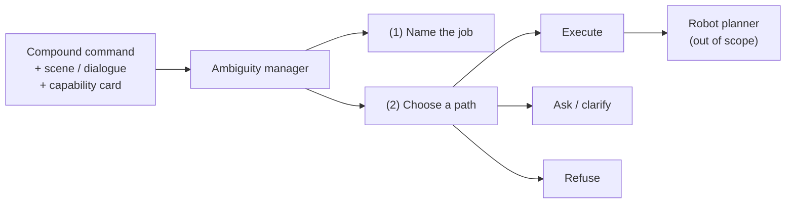

# Abstract

This report studies **compound ambiguity** in robot-directed English: several underspecified parameters co-occur in one command, so the licensed next action is not always execution. Clarification or refusal may be required. The object of study is a text-only ambiguity manager that sits above any robot planner. The manager must (1) write the intended job and (2) select a handling path among execute, clarify, and refuse.

*Figure A. Scope of the text layer. Embodied planning is excluded.*

Six systems are evaluated on **Pilot-120** (120 compound commands with gold jobs and gold routes). The evaluation is **intent-primary**: whether the system names the compound job. Routing and supporting metrics (ambiguity tags, clarification wording, slot binding, risk-sensitive decisions) are diagnostics that explain *how* handling fails when writing succeeds. The study default decoding temperature is **0.7**. Lower temperatures are an ablation; temperature **1.0** probes hotter sampling.

| # | System | Description |
|---:|---|---|
| 1 | Raw Qwen | Base model selects the route |
| 2 | Fine-tune | Parameter-efficient adapter; no manager |
| 3 | New goal-first | Short intent summary; deterministic Python router |
| 4 | New degree | Shared analysis; uncertainty thresholds; never refuses |
| 5 | New timid | Shared analysis; ask-unless-clean |
| 6 | New context-blind | Same router; scene and capability card withheld |

**Primary outcome.** Intent correctness (official protocol: two independent judges, blinded to the route).  
**Secondary outcomes.** Routing correctness and supporting diagnostics. An automatic lexical overlap screen (threshold 0.18) is used only as a fast check — never as a substitute for two-judge when that protocol exists.

At the study default (**T0.7**), goal-first routing is **54 / 120** (degree **57**, timid **29**, blind **21**) while the automatic intent screen on the shared analysis reaches **117 / 120**. Official two-judge intent is available only from the temperature-0 final-close protocol, where goal-first and raw **tie at 113 / 120**. Historically raw routing on that matched set is **88 / 120**. The dominant failure mode is therefore not “failed to name the job,” but **intent–policy dissociation**: on the T0 matched set, **62** rows pass the automatic intent screen and still mis-route (46 refuse, 13 ask, 3 execute). Cooling does not rescue goal-first routing (H3, provisional). Raising temperature to **1.0** drops goal-first routing to **42 / 120** (H4, provisional). Clarification wording remains **0 / 23** (**[FIXABLE]**); ambiguity exact-set remains near floor (**[LIMITATION]**). CPC is demoted and is not required for this interpretation.

**Contribution.** Under compound ambiguity, write-then-route can name the intended job at high rates while a brittle capability- and safety-driven router still selects the wrong handling path. The open problem is calibrated policy for compound decisions — not the absence of job writing, and not CPC.

**Keywords:** compound ambiguity; robot command understanding; intent correctness; clarification; risk-aware routing; Pilot-120.
