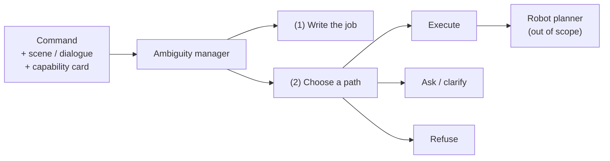

# Abstract

Robots that follow spoken or typed English still fail when a command is **compound and ambiguous**: several unknowns sit in one sentence, and the right next move is not always “do the job.” Sometimes the safe move is to ask; sometimes it is to refuse politely.

This report studies a **text-only** ambiguity manager that sits in front of any robot planner. It must (1) write the job it thinks the person meant, and (2) choose **execute**, **ask**, or **refuse**.

*Figure A. Text layer under study. Physical planning is out of scope.*

## What we evaluated

Six systems on **Pilot-120** (120 compound commands with gold labels). A temperature study used decoding temperatures **0.0, 0.3, 0.7, and 1.0** with matched replicas. System-comparison tables below use the temperature-0 matching-replica set so every system sits on the same footing.

| # | System | In one line |
|---:|---|---|
| 1 | Raw Qwen | Base model chooses the route itself |
| 2 | Fine-tune | Same prompt + small adapter; still no manager |
| 3 | New goal-first | Writes a short job box; Python picks the route |
| 4 | New degree | Same writing; uncertainty rule; never refuses |
| 5 | New timid | Same writing; asks unless the analysis looks clean |
| 6 | New context-blind | Same router; scene and capability card hidden |

## Main finding (intent first)

**Primary exam in this report: intent correctness** — did the writing name the gold job?  
**Secondary exam: routing** — did we press gold’s button? (The May proposal listed routing as primary; the evidence forced the spotlight onto intent.)

| Exam | Raw Qwen | New goal-first | Reading |
|---|---:|---:|---|
| Cheap intent | 68 / 120 *(old reasoning)* | **112 / 120** *(job box)* | Manager wins on the dedicated box* |
| Official two-judge intent | **113 / 120** *(new job box)* | **113 / 120** *(same box)* | Strong writing; same *count*, different rows* |
| Routing (secondary) | **88 / 120** | 54 / 120 | Raw wins the button |
| Risk-sensitive (53 med+high) | **0.736** | 0.491 | Raw wins under risk |

\*Do **not** subtract 112 from 68 — different text fields.

| Pattern behind 112 vs 54 | Plain reading |
|---|---|
| Forced `intent_summary` | A short job paragraph is easy for overlap/judges to pass |
| Refuse-first Python router | Button trusts capability / “unsafe” bits, not the paragraph |
| **62** intent-yes / routing-no | **46** refuse · **13** ask · **3** wrong execute |

## Supporting scores (short)

| Metric | Raw | Goal-first | Status |
|---|---:|---:|---|
| Ask-label F1 | **0.557** | 0.286 | Live |
| Clarification wording / 23 | 0 / 23 | 0 / 23 | **[FIXABLE]** |
| Slot-binding (CPC) F1 | — | 0.045 | **[FIXABLE]** |
| Ambiguity exact-set | 0 / 120 | 0 / 120 | Tagging still weak |

## Contribution

We show an **intent–policy dissociation**: write-then-route can name the job well while a brittle capability/safety router still presses the wrong button. That pattern is what Pilot-120 is for — not a complaint about sample size.

**Keywords:** robot command understanding; intent correctness; ambiguity management; clarification; risk-aware routing; Pilot-120.
