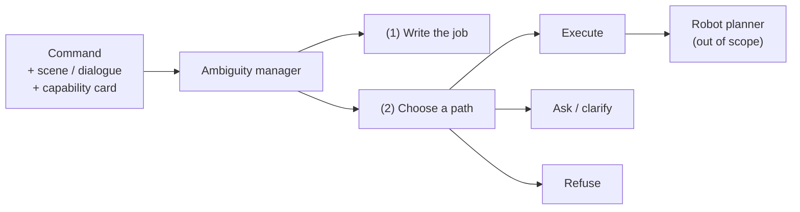

# Abstract

Robots that follow spoken or typed English still fail when a command is **compound and ambiguous**: several unknowns sit in one sentence, and the appropriate next action is not always execution. Clarification or refusal may be required. This report studies a text-only ambiguity manager that precedes any robot planner. The manager must (1) produce a written statement of the intended job and (2) select a handling path among execute, clarify, and refuse.

*Figure A. Scope of the text layer. Embodied planning is excluded.*

Six systems are evaluated on **Pilot-120**, a fixed set of 120 compound commands with gold labels. The study’s default decoding temperature is **0.7**; primary system comparisons below use the unified fix-stack emit at that default. Lower temperatures (**0.0, 0.3, 0.5**) are treated as an ablation against 0.7; temperature **1.0** is still **[Results Incoming]**. Official two-judge intent remains available only from the temperature-0 final-close protocol and is labelled as such — not as a T0.7 two-judge result.

| # | System | Description |
|---:|---|---|
| 1 | Raw Qwen | Base model selects the route |
| 2 | Fine-tune | Same prompt with a parameter-efficient adapter; no manager |
| 3 | New goal-first | Short intent summary; deterministic Python router |
| 4 | New degree | Shared analysis with goal-first; uncertainty thresholds; never refuses |
| 5 | New timid | Shared analysis with goal-first; ask-unless-clean policy |
| 6 | New context-blind | Same router; scene and capability card withheld |

**Primary outcome.** Intent correctness: whether the written job matches gold.  
**Official intent protocol.** Two independent judges, blinded to the route, both must agree that the text names the gold job.  
**Automatic overlap check.** A lexical content-word overlap rule (threshold 0.18) used as a fast automatic screen; it is **not** the final intent verdict when two-judge scores exist.  
**Secondary outcomes.** Routing correctness and supporting metrics (ambiguity, clarification, risk-sensitive decision accuracy, slot binding).

| Exam | Value | Protocol / temperature |
|---|---|---|
| **Manager routing at T0.7** (unified fix-stack) | Goal-first **54**; degree **57**; timid **29**; blind **21** / 120 | Study default |
| Intent auto screen at T0.7 (shared analysis) | **117 / 120** | Screen only — not two-judge |
| Risk-sensitive (GF, 53 med+high) at T0.7 | **32 / 53** | Unified sidecar |
| Capability accuracy (GF) at T0.7 | **0.442** | Unified eval |
| CPC micro-F1 (GF) at T0.7 | **~0.113** | Local sidecar recompute |
| Clarification wording / 23 at T0.7 | **0 / 23** | **[FIXABLE]** / unresolved |
| Ambiguity exact-set (GF) at T0.7 | **~2 / 120** (micro-F1 ~0.41) | Soft F1 up; exact-set still a **[LIMITATION]** |
| **Official two-judge intent** (GF vs raw) | **113 = 113** / 120 | **T0 final-close only** — H1 protocol evidence |
| Historical raw routing (T0 matched) | **88 / 120** | Comparator for H2; not a T0.7 raw emit |

**H1 (official intent).** Rejected on the two-judge **tie at T0** (113 = 113); absolute writing remains strong. At T0.7 the automatic intent screen is strong (**117 / 120**), but official two-judge at 0.7 is **[Results Incoming]** — do not invent a T0.7 two-judge score.

**H2 (routing).** Rejected at the study default: goal-first **54 / 120** at T0.7 does not beat historically raw **88 / 120** at T0, and barely edges degree (**57**) while beating timid (**29**). The same refuse-first mechanism appears on the T0 matched set, where **62** rows pass the automatic intent screen yet take the wrong route (46 refuse, 13 ask, 3 execute).

| Supporting metric | T0.7 (GF, unified) | Status |
|---|---:|---|
| Clarification wording / 23 | 0 / 23 | **[FIXABLE]** / unresolved |
| Slot-binding CPC F1 | ~0.113 | Improved vs historical ~0.045; still weak |
| Ambiguity exact-set | ~2 / 120 | **[LIMITATION]** (soft micro-F1 ~0.41) |
| Failed rows (CA-0292, CA-0963) | 2 shared IDs | **[FIXABLE]** via repair job **56191** |

**Contribution.** The study documents an intent–policy dissociation at the study default: write-then-route can produce strong intent writing (T0 two-judge **113 / 120**; T0.7 auto screen **117 / 120**) while a brittle capability- and safety-driven router still selects the wrong handling path (**54 / 120** at T0.7). Lowering temperature does not materially rescue goal-first routing (H3 ablation). Completing official two-judge at 0.7, finishing T1.0 (H4), and repairing wording/failed rows remain follow-on work.

**Keywords:** robot command understanding; intent correctness; ambiguity management; clarification; risk-aware routing; Pilot-120.
