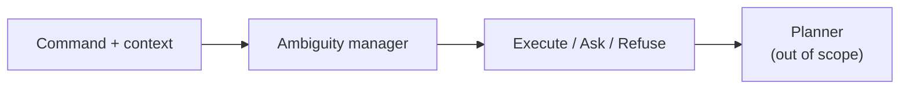

# 1. Introduction

## 1.1 Motivation

Hospital and warehouse robots are increasingly expected to follow natural-language instructions. Consider a nurse request:

> “Can the medicine tray go out after lunch?”

A human listener recovers underspecified parameters from context. An automatic system may invent those parameters, issue an inappropriate clarification, or refuse a permitted handoff. The difficulty increases for **compound** commands, in which several slots are underspecified simultaneously and risk or capability constraints affect whether the system should execute, ask, or refuse.

## 1.2 Scope

| In scope | Out of scope |
|---|---|
| Text natural-language understanding and routing (execute / clarify / refuse) | Physical robot motion |
| Command plus textual scene, dialogue, and capability card | Vision models and LVLM claims |
| Controlled comparison on Pilot-120 | Claims of physical warehouse safety |

*Figure A. Position of the ambiguity manager relative to planning.*

## 1.3 Systems and outcomes

Systems are reported in fixed order throughout:

**Raw Qwen → Fine-tune → New goal-first → New degree → New timid → New context-blind.**

| Property                     | Detail                                                                                   |
| ---------------------------- | ---------------------------------------------------------------------------------------- |
| Shared model (systems 3–6)   | Frozen Qwen3-8B                                                                          |
| Shared writing (systems 3–5) | One `intent_summary`                                                                     |
| Degree and timid             | Alternate Python routers on that shared writing                                          |
| Context-blind                | Second generation with scene and capability card withheld                                |
| Decoding                     | Temperatures 0.0, 0.3, 0.7, and 1.0; comparison tables use the temperature-0 matched set |

| Outcome | Role | Definition |
|---|---|---|
| Intent correctness | Primary | Written job matches gold |
| Routing correctness | Secondary | Predicted handling path matches gold |

Intent is treated as primary because the strongest empirical result is improved job writing under write-then-route generation; routing is retained to explain how handling paths diverge after that writing.

## 1.4 Preview of results

| Result | Value |
|---|---|
| Goal-first cheap intent | **112 / 120** |
| Goal-first two-judge intent | **113 / 120** |
| Goal-first routing | 54 / 120 (raw: **88 / 120**) |
| Intent correct, routing incorrect | **62** (46 refuse, 13 ask, 3 execute) |
| Risk-sensitive accuracy (53 rows) | raw **0.736**; goal-first 0.491 |
| Clarification wording / CPC F1 | 0 / 23; 0.045 |

## 1.5 Structure of the report

Chapter 2 reviews related work and states which design choices were adopted. Chapter 3 presents the research question and hypotheses. Chapter 4 describes Pilot-120, the six systems, and the scoring protocols. Chapter 5 reports results and analyses the intent–policy pattern. Chapter 6 concludes and outlines future work. A glossary defines recurring terms.
