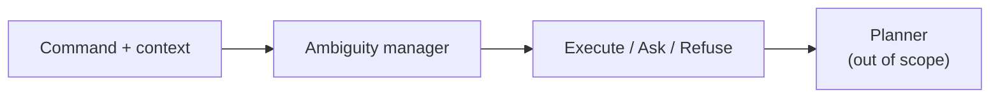

# 1. Introduction

## 1.1 Motivation

Hospital and warehouse robots are increasingly expected to follow natural-language instructions. Consider a nurse request:

> “Can the medicine tray go out after lunch?”

A human listener recovers underspecified parameters from context. An automatic system may invent those parameters, issue an inappropriate clarification, or refuse a permitted handoff.

This study focuses on **compound ambiguity**, where several unknowns co-occur in one command. For example:

> “Add a small amount of liquid soap to the soap dispenser with the assigned dosing cup after the check.”

Here quantity (“small amount”), object, tool, and timing can all be underspecified at once, and licensed alternatives may exist (for example 20 ml versus 60 ml). Risk and capability constraints then affect whether the system should **execute**, **ask**, or **refuse**.

## 1.2 Scope

| In scope | Out of scope |
|---|---|
| Text natural-language understanding and routing (execute / clarify / refuse) | Physical robot motion |
| Command plus textual scene, dialogue, and capability card | Vision models and LVLM claims |
| Controlled comparison on Pilot-120 | Claims of physical warehouse safety |

*Figure A. Position of the ambiguity manager relative to planning.*

## 1.3 Systems and outcomes

Systems are reported in fixed order throughout:

**Raw Qwen → Fine-tune → New goal-first → New degree → New timid → New context-blind.**

| Property | Detail |
|---|---|
| Shared model (systems 3–6) | Frozen Qwen3-8B |
| Shared writing (systems 3–5) | One `intent_summary` |
| Degree and timid | Alternate Python routers on that shared writing |
| Context-blind | Second generation with scene and capability card withheld |
| Default temperature | **0.7** (primary system comparison) |
| Temperature study | Lower-T ablation **0.0 / 0.3 / 0.5** vs 0.7; higher-T **1.0** still **[Results Incoming]** |

| Outcome | Role | Definition |
|---|---|---|
| Intent correctness | Primary | Written job matches gold; **official** protocol is two-judge agreement |
| Automatic overlap | Screening check | Lexical overlap ≥ 0.18; used when a fast automatic score is needed |
| Routing correctness | Secondary | Predicted handling path matches gold |

## 1.4 Preview of results

| Result | Value | Note |
|---|---|---|
| Manager routing at **T0.7** (default) | GF **54**; degree **57**; timid **29**; blind **21** / 120 | Unified fix-stack job **55670** |
| Intent auto screen at T0.7 | **117 / 120** (shared analysis) | Screen only — official two-judge at 0.7 **[Results Incoming]** |
| Official two-judge (GF vs raw) | **113 = 113** / 120 | **T0 final-close** protocol evidence for H1 |
| Historical raw routing (T0) | **88 / 120** | H2 comparator; GF 54 at T0.7 does not beat it |
| Intent-yes / routing-no slab | **62** at T0 (46 refuse, 13 ask, 3 execute) | Mechanism measured on T0 matched set |
| CPC / wording / ambiguity at T0.7 | ~0.113; **0 / 23**; exact-set ~2 / 120 | Wording **[FIXABLE]**; exact-set **[LIMITATION]** |
| H3 / H4 | Lower-T ablation filled; T1.0 Incoming | Cooling does not rescue GF routing |

## 1.5 Structure of the report

Chapter 2 reviews related work and states which design choices were adopted. Chapter 3 presents the research question and hypotheses. Chapter 4 describes Pilot-120, the six systems, and the scoring protocols. Chapter 5 reports results and analyses the intent–policy pattern. Chapter 6 concludes and outlines future work, including router recalibration and the temperature-0.7-centred scoreboard. A glossary defines recurring terms.
