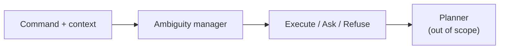

# 1. Introduction

## 1.1 The everyday failure mode

Imagine a warehouse robot. A person types:

> “Move the selected return item to its assigned destination shortly.”

A human co-worker fills in the blanks from the scene. A language model may invent those blanks, ask the wrong question, or refuse a move the handbook already allows.

The hard case is a **compound** command: several slots underspecified at once, with risk and capability in play. The right next step may be **ask** or **refuse**, not always **act**.

## 1.2 What this work is (and is not)

| In scope | Out of scope |
|---|---|
| Text NLU + routing (execute / clarify / refuse) | Physical robot motion |
| Command + textual scene, dialogue, capability card | Vision / LVLM claims |
| Honest Pilot-120 comparison | “Safe in the real warehouse” |

*Figure A. The layer under study sits in front of any planner.*

## 1.3 What was built and measured

**Locked system order** (used in every table):

**Raw Qwen → Fine-tune → New goal-first → New degree → New timid → New context-blind.**

| Fact | Detail |
|---|---|
| Shared brain (systems 3–6) | Frozen Qwen3-8B |
| Shared writing (3–5) | One `intent_summary` paragraph |
| What changes for 4–5 | Which **Python** router reads that paragraph |
| Context-blind | Second generation with scene/card hidden |
| Degree / timid | **Not** “be braver / be careful” prompts |

| Exam        | Plain question                     |
| ----------- | ---------------------------------- |
| **Intent**  | Did the writing name the gold job? |
| **Routing** | Did we press gold’s button?        |

The May proposal treated routing as primary. This report keeps that, and also spotlights intent, because the strongest positive result is: the manager often *writes* the job well while *routing* poorly.

## 1.4 Preview of results

| Claim                       | Number                                    |
| --------------------------- | ----------------------------------------- |
| Primary routing hypothesis  | **Not supported**                         |
| Goal-first routing          | 54 / 120 (raw: **88 / 120**)              |
| Goal-first cheap intent     | **112 / 120**                             |
| Goal-first two-judge intent | **113 / 120**                             |
| Intent yes, routing no      | **62** (= 46 refuse + 13 ask + 3 execute) |
| Risk-sensitive (53 rows)    | raw **0.736** · goal-first 0.491          |
| Wording / CPC               | 0 / 23 · 0.045 — both **[FIXABLE]**       |

Those secondary zeros have named engineering causes in Chapter 5; they do not overturn the intent/routing split.

## 1.5 Document map

| Chapter | Content |
|---|---|
| 2 | Prior work (ambiguity, clarification, risk) |
| 3 | Research question and hypothesis |
| 4 | Pilot-120, six systems, scoring |
| 5 | Results, figures, failure analysis |
| 6 | Conclusion and future work |
| — | [[glossary]] |
