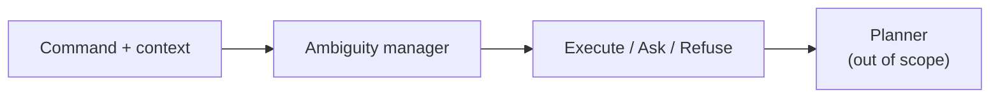

# 1. Introduction

## 1.1 The everyday failure mode

Imagine a hospital supply robot. A nurse types:

> “Can the medicine tray go out after lunch?”

A human fills in the blanks from the room: which tray, which lunch slot, who receives it. The robot may invent those blanks, ask the wrong question, or refuse a handoff the handbook already allows.

The hard case is a **compound** command: several slots underspecified at once, with risk and capability in play. The right next step may be **ask** or **refuse**, not always **act**.

## 1.2 What this work is (and is not)

| In scope | Out of scope |
|---|---|
| Text NLU + routing (execute / clarify / refuse) | Physical robot motion |
| Command + textual scene, dialogue, capability card | Vision / LVLM claims |
| Honest Pilot-120 comparison | “Safe in the real warehouse” |

*Figure A. The layer under study sits in front of any planner.*

## 1.3 What was built and measured

**Locked system order:**

**Raw Qwen → Fine-tune → New goal-first → New degree → New timid → New context-blind.**

| Fact | Detail |
|---|---|
| Shared brain (systems 3–6) | Frozen Qwen3-8B |
| Shared writing (3–5) | One `intent_summary` paragraph |
| What changes for 4–5 | Which **Python** router reads that paragraph |
| Context-blind | Second generation with scene/card hidden |
| Decoding | Temperature study at **0.0, 0.3, 0.7, 1.0**; comparison tables use the T=0 matched set |

| Exam | Role in this report | Plain question |
|---|---|---|
| **Intent** | **Primary** | Did the writing name the gold job? |
| **Routing** | Secondary | Did we press gold’s button? |

The May proposal treated routing as primary. This report inverts the spotlight because the result we can stand on is: the writing often names the job, and the button still misses.

## 1.4 Preview of results

| Claim | Number |
|---|---|
| Primary intent success (goal-first) | **112 / 120** cheap · **113 / 120** two-judge |
| How it gets there | Forced short job box + scene nouns → overlap/judges pass |
| Secondary routing | 54 / 120 (raw **88 / 120**) |
| Intent–policy split | **62** (= 46 refuse + 13 ask + 3 execute) |
| Risk-sensitive (53 rows) | raw **0.736** · goal-first 0.491 |
| Wording / CPC | 0 / 23 · 0.045 — both **[FIXABLE]** |

## 1.5 Document map

| Chapter | Content |
|---|---|
| 2 | Prior work → what we actually built from it |
| 3 | Research question and hypothesis |
| 4 | Pilot-120, six systems, scoring |
| 5 | Results, figures, the intent–policy pattern |
| 6 | Conclusion and future work |
| — | [[glossary]] |
