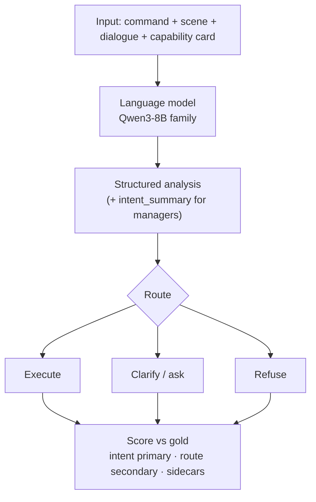
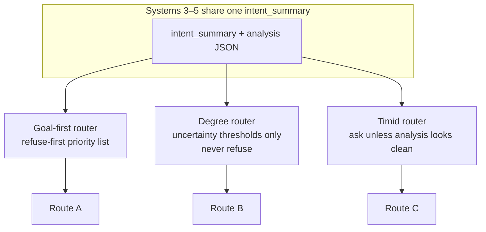
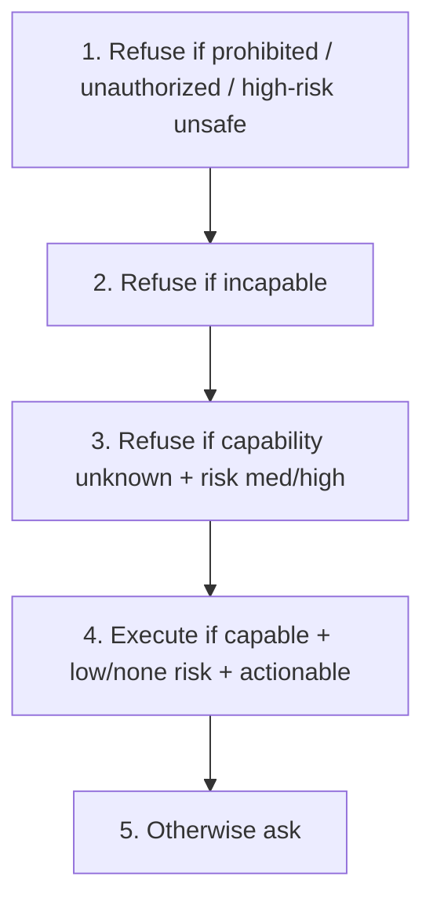
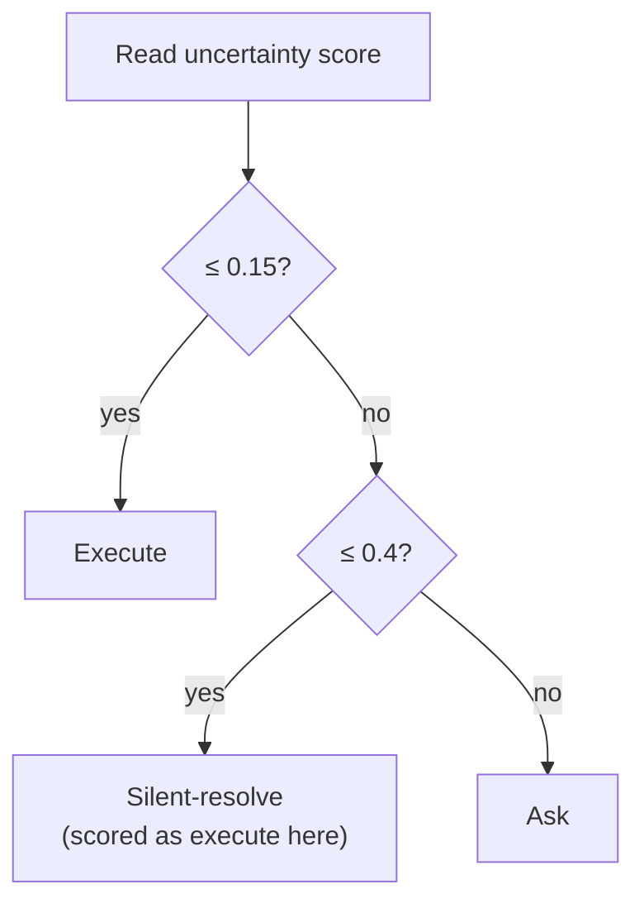
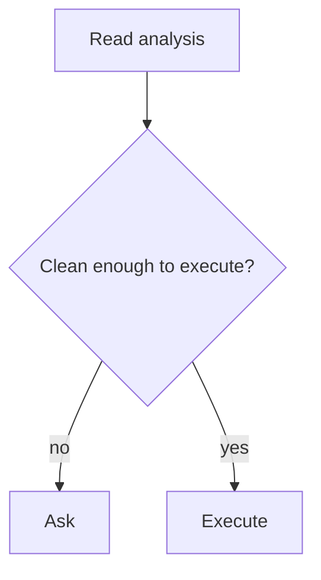

# 4. Research methodology

## 4.1 Overview

We compare six text systems on **Pilot-120**, a fixed compound-ambiguity exam. No physical robot. The study default decoding temperature is **0.7**. A temperature study also runs **0.0, 0.3, 0.5, and 1.0**; primary system comparisons in Chapter 5 use the unified fix-stack emit at **0.7**, with lower temperatures as ablation and **1.0** as the higher-temperature probe. Mechanism deep-dives that were computed on the temperature-0 matched set (the **62**, CA-0007, confusion heatmaps) are labelled as such.

*Figure B. Evaluation pipeline on Pilot-120.*

## 4.2 Data: Pilot-120

Pilot-120 is 120 **compound** commands: each item packages multi-slot underspecification with one gold job and one gold handling path. That size is enough to compare systems and to expose the intent–policy pattern that compound ambiguity produces (Chapter 5).

| Gold route | Count |
|---|---:|
| Execute | 76 |
| Clarify (ask) | 23 |
| Refuse | 21 |
| Silent-resolve | 0 |

Core gold is **frozen**. Official sidecars:

| Sidecar | Adds | Eligible size |
|---|---|---|
| CPC | Filled parameter cells | 678 cells |
| Risk | none / low / medium / high / unknown | **53** med+high |
| Wording | `must_convey` on gold-ask rows | **23** rows |

Models never see sidecars at generation time.

## 4.3 Systems and how they differ

| # | System | Proposal role | What changes |
|---:|---|---|---|
| 1 | Raw Qwen | Direct LLM | Model emits route |
| 2 | Fine-tune | Supervised fine-tune | PEFT adapter; no manager box |
| 3 | New goal-first | Full write-then-route | `intent_summary` + `_route_goal_first_v2` |
| 4 | New degree | Degree policy | **Same writing**; uncertainty only; never refuses |
| 5 | New timid | Conservative control | **Same writing**; ask-unless-clean |
| 6 | New context-blind | Context ablation (CLARA-style lesson) | Card/scene hidden; same goal-first router |

*Figure C. Same writing, three policies — the ablation that proves routing is not “new understanding.”*

*Figure D. Goal-first router priority.*

*Figure E. Degree router — no refuse button.*

*Figure F. Timid router — ask unless clean (simplified).*

| Ablation (study default **T0.7**, unified) | Routing on Pilot-120 |
|---|---:|
| Goal-first | **54 / 120** |
| Degree | **57 / 120** |
| Timid | **29 / 120** |
| Context-blind | **21 / 120** |

| Examiner path | Location |
|---|---|
| Repo | `Documents\University\Research Project` |
| Manager code | `src/ambiguity_manager/systems/` |
| Scripts / gold | `scripts/` · `data/annotations/pilot_120_v1/` |

## 4.4 What we measure

### Intent correctness (**primary**)

| Protocol | Role | Rule |
|---|---|---|
| **Two-judge** | Official primary | Two judges, blinded to the route, both say the text names the gold job |
| **Automatic overlap** | Screening check only | Jaccard on content words ≥ **0.18**, no polarity flip |

Overlap of 0.368 means about 37% of the combined content-word set is shared; it is not a probability. Automatic overlap on raw/fine-tune historically used written reasoning; manager scores use `intent_summary`. Those fields are not interchangeable. When both protocols exist for the same intent box, **two-judge is the final intent answer**.

### Routing correctness (**secondary**)

Predicted route equals gold route (execute / clarify / refuse).

### Clarification, CPC, risk, supporting

| Metric                               | What it is                                                                                                                                                                                                                                                        |
| ------------------------------------ | ----------------------------------------------------------------------------------------------------------------------------------------------------------------------------------------------------------------------------------------------------------------- |
| Ask-label F1                         | Harmonic mean of precision and recall for pressing Ask on the 23 gold-ask rows                                                                                                                                                                                    |
| Wording accuracy                     | On those 23 rows, does `clarification_question` cover every licensed alternative in `must_convey`?                                                                                                                                                                |
| **CPC F1**                           | Slot-binding **micro-F1**: predicted parameter cells versus official gold cells that are marked `status == filled` (678 eligible gold cells). Only predicted cells also marked `filled` count.                                                                    |
| **Risk-sensitive decision accuracy** | **Accuracy** (not F1): fraction of correct routes on the **53** gold rows labelled medium or high risk. The remaining rows are low (64), unknown (3), or none (0) and are **excluded from this exam by design** so the metric focuses on higher-stakes decisions. |
| Ambiguity / capability / safe-reject | Supporting diagnostics                                                                                                                                                                                                                                            |

## 4.5 Runs

| Run | Temperatures | Role |
|---|---|---|
| Study default | **0.7** | Intended operating temperature **[Results Incoming]** for full tables |
| Temperature study | 0.0, 0.3, 0.7, 1.0 × matched replicas | Sensitivity (H3) |
| Completed comparison set (interim) | 0.0 matched replicas | Head-to-head numbers available now in Chapter 5 |
| CPU sidecar scoring | n/a | CPC / risk / wording / ask-label on **frozen** predictions (already done) |
| Final-close | 0.0 | Intent boxes + official two-judge |

**Salvage:** a few broken JSON rows rebuilt on CPU. Headline routing **54** includes three such rows (harsh **51**).

## 4.6 Known secondary failures

These are **not** waiting on the GPU temperature sweep. They were scored on CPU against official sidecars using already frozen predictions.

| Issue | Marker | Consequence |
|---|---|---|
| Empty `candidate_interpretations` | **[FIXABLE]** | Wording templates; wording accuracy 0 / 23 |
| CPC values stamped `unknown` / `not_applicable` despite usable values | **[FIXABLE]** | Official CPC F1 remains 0.045 |
| Ambiguity exact-set match of 0 / 120 | **[FIXABLE]** on next emit | Frozen bags: quality limit + constrained prompt omitted Pilot-17; code fix is on job 54774 |
