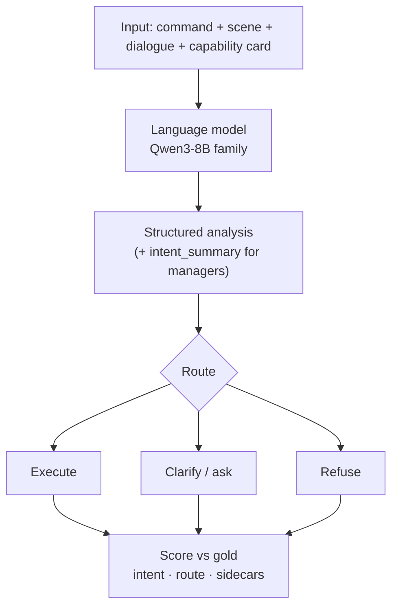
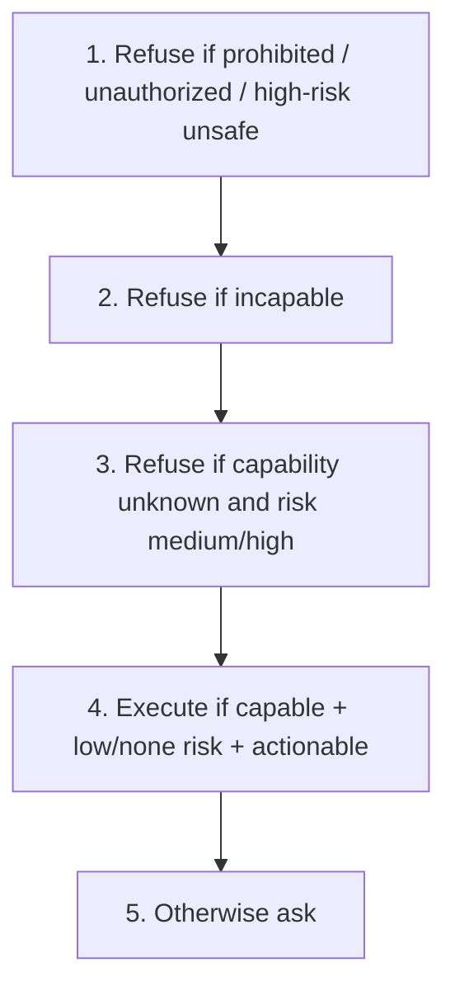

# 4. Research methodology

## 4.1 Overview

We compare six text systems on **Pilot-120** with shared scoring protocols. No physical robot. Main scoreboard uses **temperature 0.0** (greedy) unless noted.

*Figure B. Evaluation pipeline on Pilot-120.*

## 4.2 Data: Pilot-120

Pilot-120 is the project’s compound-command benchmark: 120 commands where several underspecified slots can co-occur, with one gold job and one gold path each. It realises the proposal’s evaluation intent (compound ambiguity + routing) in a fixed, examinable set.

| Gold route | Count |
|---|---:|
| Execute | 76 |
| Clarify (ask) | 23 |
| Refuse | 21 |
| Silent-resolve | 0 |

Core gold is **frozen**. Later official labels live in sidecars:

| Sidecar | Adds | Eligible size |
|---|---|---|
| CPC | Filled parameter cells | 678 cells |
| Risk | none / low / medium / high / unknown | **53** med+high for risk exam |
| Wording | `must_convey` on gold-ask rows | **23** rows |

Labels: dual-model annotation + adjudication. Models never see sidecars at generation time.

| N = 120 is enough for… | Not enough for… |
|---|---|
| System comparison + mechanisms (the 62) | Industrial generality claims |

**[LIMITATION]** Pilot-scale by design.

## 4.3 Systems (proposal map → what we ran)

The May proposal required direct LLM interpretation, degree-based routing, context-blind control, fine-tuning, and a full type/risk-aware manager, plus uniform policies as baselines. Live systems:

| # | System | Proposal role | What actually changes |
|---:|---|---|---|
| 1 | **Raw Qwen** | Direct base LLM | Model emits JSON including the route |
| 2 | **Fine-tune** | Supervised fine-tune | Same prompt + PEFT adapter (`adapter_scale=0.18`); no manager box |
| 3 | **New goal-first** | Full write-then-route manager | Must write `intent_summary`; Python `_route_goal_first_v2` presses the button |
| 4 | **New degree** | Degree-based policy | **Identical writing**; uncertainty thresholds; **never refuses** |
| 5 | **New timid** | Conservative / clarify-heavy control | **Identical writing**; `_route_conservative` asks unless clean |
| 6 | **New context-blind** | Context-blind control | Scene, dialogue, and card **hidden**; same goal-first router |

Constant “always execute / always clarify / always refuse” policies are used as **analytic bounds** (e.g. always-refuse matches gold’s 21 refuse rows), not as extra GPU systems in the main six.

Degree / timid are **not** “be braver / be careful” prompts. Same paragraph → different Python → routing moves.

*Figure C. Goal-first router priority (deterministic).*

| Ablation | Change vs goal-first | Routing on Pilot-120 |
|---|---|---:|
| Degree | Never refuses | 59 / 120 |
| Timid | Ask-unless-clean | 26 / 120 |
| Goal-first | Full priority list | 54 / 120 |
| Context-blind | Same list; card hidden | 21 / 120 |

Bad capability/safety stamp + good job box → router trusts the stamp first. That is the main claim behind the 62.

| Examiner path | Location |
|---|---|
| Repo | `Documents\University\Research Project` |
| Manager code | `src/ambiguity_manager/systems/` |
| Scripts / gold | `scripts/` · `data/annotations/pilot_120_v1/` |

## 4.4 What we measure

### Intent correctness

Did the writing name the gold job?

| Protocol | Rule |
|---|---|
| Cheap overlap | Jaccard on content words ≥ **0.18**, no polarity flip |
| Two-judge (SGC) | Two judges, blinded to the route, both say the text names the gold job |

Overlap **0.368** means ~37% shared content-word set — **not** “36.8% probability.” Raw/fine-tune cheap scores historically used **written reasoning**; final-close also collected **new intent boxes**. **Do not subtract** 112 from 68. Same count **113 ≠ same rows**.

### Routing correctness

Predicted `terminal_strategy` = gold (execute / clarify / refuse). Not a synonym for understanding.

### Clarification (two exams)

| Name | Asks |
|---|---|
| **Ask-label F1** | Did we press Ask on the 23 gold-ask rows? |
| **Wording accuracy** | Does the question cover every licensed alternative? |

### CPC F1 / risk-sensitive / supporting

| Metric | Definition |
|---|---|
| CPC F1 | Micro-F1 on official `status == filled` cells |
| Risk-sensitive | Routing accuracy on **53** medium+high rows |
| Ambiguity F1 / exact-set | Predicted vs gold ambiguity tags |
| Capability accuracy | Predicted vs gold capability |
| Safe-rejection recall | Gold-refuse rows that were refused |
| Unsafe silent-resolve | Undefined here (gold support 0; nobody predicted it) |

## 4.5 Runs and salvage

| Run | Temperature | Replicas | Role |
|---|---|---|---|
| T39 frozen | 0.0 | 5 matching | Raw, fine-tune (+ older archive) |
| Live manager v2 | 0.0 | 3 after salvage | Goal-first family |
| CPU sidecar scoring | n/a | — | CPC / risk / wording / ask-label |
| Final-close | 0.0 | — | Intent boxes + official two-judge |

**Salvage:** a few broken JSON rows rebuilt on CPU. Headline routing **54 / 120** includes three such rows (harsh alternative **51 / 120**).

## 4.6 Marked gaps

| Item | Marker |
|---|---|
| Clarification candidates empty → template questions | **[FIXABLE]** — frozen wording 0/23 until new emit |
| CPC `value` filled but `status` left `unknown` | **[FIXABLE]** |
| Ambiguity exact-set 0/120 | **[LIMITATION]** |
| No embodied robot evaluation | **[LIMITATION]** by design |
| Optional temperature ≠ 0 study | **[PENDING]** — not required for the main Pilot-120 verdict |
