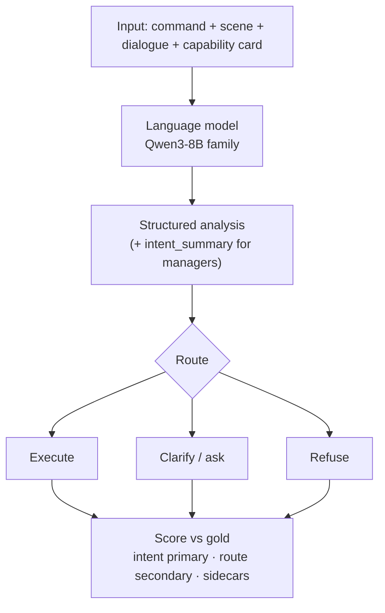
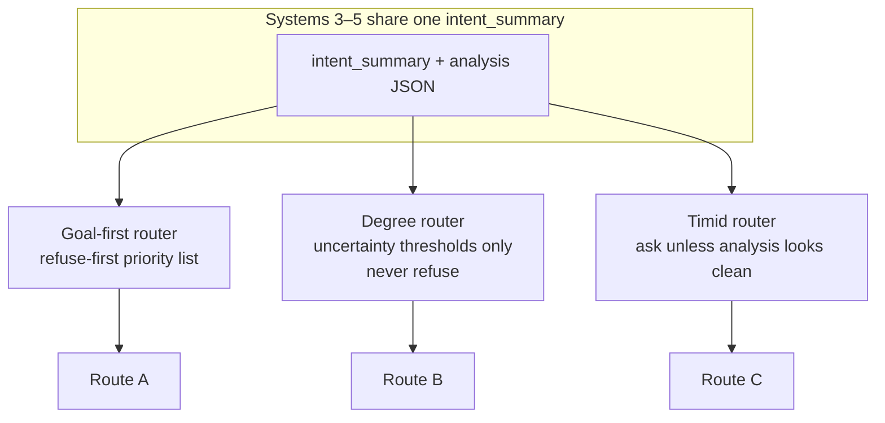
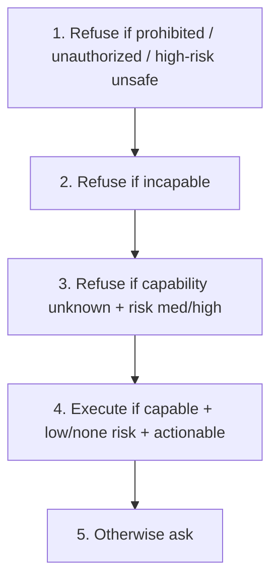
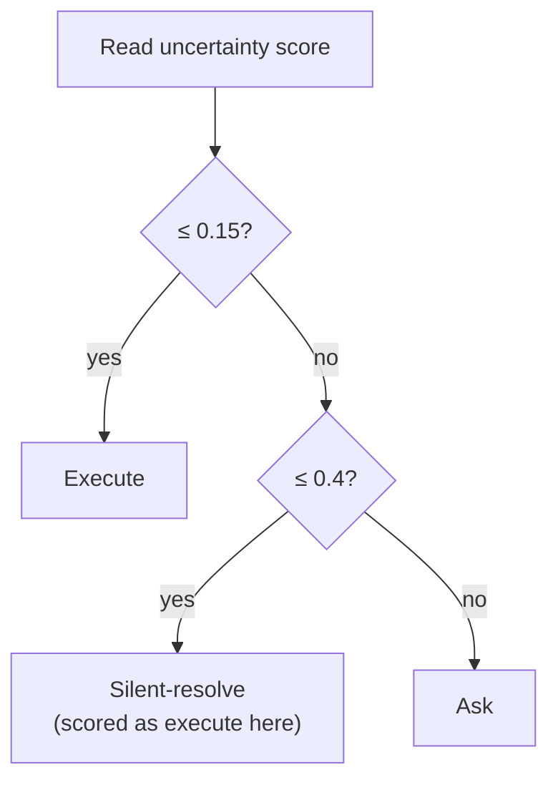
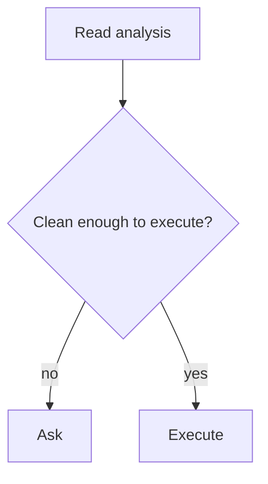

# 4. Research methodology

## 4.1 Overview

We compare six text systems on **Pilot-120**. No physical robot. A temperature study ran decoding at **0.0, 0.3, 0.7, and 1.0** with matched replicas. System-comparison tables use the temperature-0 matching-replica set.

*Figure B. Evaluation pipeline on Pilot-120.*

## 4.2 Data: Pilot-120

Pilot-120 is 120 compound commands with one gold job and one gold path each. That size is enough to compare systems and to expose the intent–policy pattern (Chapter 5).

| Gold route | Count |
|---|---:|
| Execute | 76 |
| Clarify (ask) | 23 |
| Refuse | 21 |
| Silent-resolve | 0 |

Core gold is **frozen**. Official sidecars:

| Sidecar | Adds | Eligible size |
|---|---|---|
| CPC | Filled parameter cells | 678 cells |
| Risk | none / low / medium / high / unknown | **53** med+high |
| Wording | `must_convey` on gold-ask rows | **23** rows |

Models never see sidecars at generation time.

## 4.3 Systems and how they differ

| # | System | Proposal role | What changes |
|---:|---|---|---|
| 1 | Raw Qwen | Direct LLM | Model emits route |
| 2 | Fine-tune | Supervised fine-tune | PEFT adapter; no manager box |
| 3 | New goal-first | Full write-then-route | `intent_summary` + `_route_goal_first_v2` |
| 4 | New degree | Degree policy | **Same writing**; uncertainty only; never refuses |
| 5 | New timid | Conservative control | **Same writing**; ask-unless-clean |
| 6 | New context-blind | Context ablation (CLARA-style lesson) | Card/scene hidden; same goal-first router |

*Figure C. Same writing, three policies — the ablation that proves routing is not “new understanding.”*

*Figure D. Goal-first router priority.*

*Figure E. Degree router — no refuse button.*

*Figure F. Timid router — ask unless clean (simplified).*

| Ablation | Routing on Pilot-120 |
|---|---:|
| Goal-first | 54 / 120 |
| Degree | 59 / 120 |
| Timid | 26 / 120 |
| Context-blind | 21 / 120 |

| Examiner path | Location |
|---|---|
| Repo | `Documents\University\Research Project` |
| Manager code | `src/ambiguity_manager/systems/` |
| Scripts / gold | `scripts/` · `data/annotations/pilot_120_v1/` |

## 4.4 What we measure

### Intent correctness (**primary**)

| Protocol | Rule |
|---|---|
| Cheap overlap | Jaccard on content words ≥ **0.18**, no polarity flip |
| Two-judge | Two judges, blinded to the route, both say the text names the gold job |

Overlap of 0.368 indicates that about 37% of the combined content-word set is shared; it is not a probability. Raw and fine-tune cheap scores use written reasoning; manager scores use `intent_summary`. These fields are not interchangeable for arithmetic comparison.

### Routing correctness (**secondary**)

Predicted route = gold. Explains *how* we got there after intent.

### Clarification, CPC, risk, supporting

| Metric | Definition |
|---|---|
| Ask-label F1 | Pressed Ask on the 23 gold-ask rows? |
| Wording | Question covers licensed alternatives? |
| CPC F1 | Micro-F1 on `status == filled` cells |
| Risk-sensitive | Routing accuracy on 53 med+high rows |
| Ambiguity / capability / safe-reject | Supporting diagnostics |

## 4.5 Runs

| Run | Temperatures | Role |
|---|---|---|
| Temperature study | 0.0, 0.3, 0.7, 1.0 × matched replicas | Sensitivity |
| System comparison tables | Temperature 0 matching set | Fair head-to-head |
| CPU sidecar scoring | n/a | CPC / risk / wording / ask-label |
| Final-close | Temperature 0 | Intent boxes + two-judge |

**Salvage:** a few broken JSON rows rebuilt on CPU. Headline routing **54** includes three such rows (harsh **51**).

## 4.6 Known secondary failures

| Issue | Consequence |
|---|---|
| Empty `candidate_interpretations` | Clarification wording templates; wording accuracy 0 / 23 on frozen predictions |
| CPC values stamped `unknown` / `not_applicable` despite usable values | Official CPC F1 remains 0.045 |
| Ambiguity exact-set match of 0 / 120 | Tagging remains weak; does not negate the intent–policy pattern |
