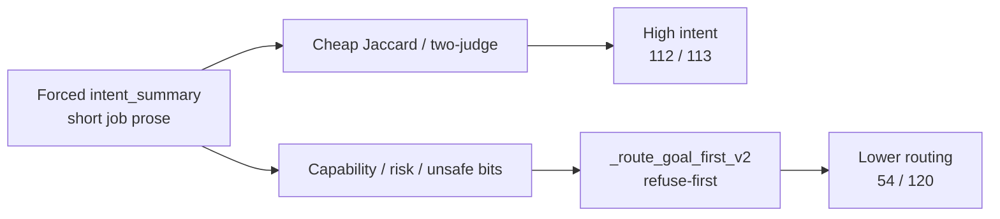

# 5. Results

This chapter answers the research question with evidence, then explains *why* the numbers look the way they do. Figures are large PNGs under `figures/`. Every table keeps the locked system order.

---

## 5.1 The story in one page

| # | Finding |
|---:|---|
| 1 | Goal-first improves **intent** writing (primary outcome) |
| 2 | Goal-first routing is weaker than raw Qwen (secondary outcome) |
| 3 | The dissociation is explained by forced intent summaries versus refuse-first routing on miscalibrated fields |
| 4 | Clarification wording and CPC failures have identified implementation causes |

*Figure 1. Primary outcome: intent correctness. Raw and fine-tune cheap scores use T39 written reasoning; goal-first uses `intent_summary`. Field differences preclude subtracting 112 from 68.*

*Figure 2. Primary intent beside secondary routing. The highlighted region marks 62 rows with correct intent and incorrect routing.*

*Figure 3. Secondary outcome: routing correctness. Context-blind routing of 21 / 120 coincides with gold refuse support under a refuse-heavy policy.*

---

## 5.2 How goal-first reaches 112 / 120 intent

This is the pattern Pilot-120 is for:

| Step | What happens | Effect on score |
|---|---|---|
| 1 | Prompt forces a dedicated job paragraph first | Writing is scored on a clean field, not buried reasoning |
| 2 | Scene nouns land in that paragraph | Overlap ≥ 0.18 often passes (e.g. tray, meal, delivery) |
| 3 | Two-judge check on the same box | **113 / 120** — not just a lexical fluke |
| 4 | Router **never reads** “did the box match gold?” | Button uses capability / unauthorized / risk bits |
| 5 | Those bits are often wrong (capability acc. ≈ 0.425) | Intent stays high; routing collapses |

So 112 / 120 is a higher primary-outcome score than raw Qwen’s 68 / 120 on written reasoning. It is not an arithmetic improvement over raw Qwen’s later 113 / 120 on a newly collected intent box, which is a different field. The empirical claim is that intent-first writing succeeds on Pilot-120, while routing policy still diverges from gold after that writing.

---

## 5.3 Intent and routing scoreboard

| System | Cheap intent **(primary)** | Official two-judge | Routing *(secondary)* |
|---|---:|---:|---:|
| Raw Qwen | 68 / 120 (T39 *reasoning*) | **113 / 120** (*new intent box*) | **88 / 120** |
| Fine-tune | 60 / 120 (T39 reasoning) | **107 / 120** (new intent box) | 87 / 120 |
| New goal-first | **112 / 120** (`intent_summary`) | **113 / 120** (same box) | **54 / 120** |
| New degree | (same 112 box) | (same writing) | 59 / 120 |
| New timid | (same 112 box) | (same writing) | 26 / 120 |
| New context-blind | — | **108 / 120** (blind box) | 21 / 120 |

Two-judge protocol: two independent models, both must agree, blinded to the route.

| Comparability note | Explanation |
|---|---|
| 112 versus 68 | Different fields (`intent_summary` versus written reasoning) |
| Two counts of 113 | Same total, different missed rows |
| Routing 54 / 59 / 26 | Identical writing; different Python policies |

| | Routing correct | Routing wrong |
|---|---:|---:|
| Intent yes | 50 | **62** |
| Intent no | 4 | 4 |

Gold-do-it rows where the box still looked like the job: **71 / 76**.

---

## 5.4 Case study: correct intent, incorrect route

**CA-0007.** Command: “Can the selected controlled medicine tray be delivered after a scheduled meal service?”  
Follow-up from the nurse: treat the utterance as a delivery request rather than a capability question.

Gold job (short): deliver the selected controlled medicine tray after the 11:00 meal service.  
Gold route: clarify (two trays are pending and no recipient is named in the command).

| System | Intent | Route |
|---|---|---|
| New goal-first | Yes (overlap 0.275); names delivery after 11:00 | Refuse (unsafe / unauthorized) |
| New timid (same writing) | Yes | Ask (matches gold) |
| Raw Qwen | Yes on reasoning (0.237) | Execute |

Identical intent writing with different routers yields different routes. Primary intent can succeed while secondary routing fails.

---

## 5.5 The 62: intent yes, routing no

*Figure 4. Why goal-first missed the button after naming the job. Dominated by `known_incapable` and `known_unsafe_or_prohibited`, not by “too many polite questions.”*

*Figure 5. Broader breakdown of intent-yes / routing-no behaviour (refuse vs ask vs wrong execute).*

| Piece of the 62 | Count | Meaning |
|---|---:|---|
| Total intent-yes / routing-no | **62** | Not “62 over-asks” and not “62 refuses” |
| Refuse | 46 | Headline failure mode |
| Ask | 13 | Still wrong vs gold |
| Wrong execute | 3 | Too brave |
| Of refuses: `known_incapable` | 36 | Gold capable **34** · conditional 2 · incapable **0** |
| Of refuses: unsafe / unauthorized | 10 | Gold capable, live low risk |

When a usable intent summary co-occurs with an incorrect capability or safety field, the router acts on the field. Intent remains high; routing falls.

| Same writing, different Python | Routing |
|---|---:|
| Goal-first | 54 / 120 |
| Degree (never refuse) | 59 / 120 |
| Timid (ask unless clean) | 26 / 120 |
| Context-blind | 21 / 120 |

| Extra fact | Number |
|---|---|
| Degree gold-refuse recall | **0 / 21** |
| Timid false asks | 55 |
| Context-blind capable recall | **0** |
| Context-blind refuses of gold-do-it | 75 / 76 |

*Figure 6. New goal-first capability accuracy (0.425) is worse than raw (0.667). The router trusts this bit.*

*Figure 7. Wrong “cannot” / “unsafe” bits push refuses even when the job box is right.*
---

## 5.6 Clarification: asking vs asking well

*Figure 8. Ask-label precision–recall. Raw asks often and leads F1; goal-first asks less and is less precise; degree floods false asks; timid is the honest “ask unless clean” cloud.*

| System | Ask-label F1 | Wording correct / 23 |
|---|---:|---:|
| Raw Qwen | **0.557** | **0 / 23** (T39 had no question string) |
| Fine-tune | 0.540 | 0 / 23 |
| New goal-first | 0.286 | 0 / 23 |
| New degree | 0.253 | 0 / 23 |
| New timid | 0.286 | 0 / 23 |
| New context-blind | 0.000 | 0 / 23 |

Ask-label asks: “did we press Ask?” Wording asks: “did the question name the licensed alternatives?”

### Clarification wording of 0 / 23

| What happened on 23 gold-ask rows | Count | Wording credit |
|---|---:|---|
| Refused | 14 | 0 |
| Executed instead of asking | 3 | 0 |
| Asked (slot-name templates) | 6 | **still 0** |

| Cause | Detail |
|---|---|
| Generator needs | Two filled values in `candidate_interpretations` |
| Live v2 emitted | Empty candidates on **all 120** rows |
| Result | Never built “Do you mean X or Y?” |
| Unofficial 1.1.0 replay | ~**2 / 23** on the six asked rows only |
| Frozen official score | Remains **0 / 23** until new questions are emitted |
---

## 5.7 Slot binding (CPC) and risk

| System | CPC F1 | Risk-sensitive accuracy (53 med+high) |
|---|---:|---:|
| Raw Qwen | — (no filled CPC cells) | **0.736** (39 / 53) |
| Fine-tune | — | 0.755 (40 / 53) |
| New goal-first | **0.045** | 0.491 (26 / 53) |
| New degree | 0.045 | 0.434 (23 / 53) |
| New timid | 0.045 | 0.245 (13 / 53) |
| New context-blind | — | 0.377 (20 / 53) |

### CPC F1 of 0.045

| Quantity | Count |
|---|---:|
| Gold filled cells | 678 |
| Pred cells with `status == filled` | 78 (only 6 / 120 rows) |
| True / false / false-neg | 17 / 61 / 661 |
| Official F1 | **0.045** |

| Bug | Reading |
|---|---|
| Model writes a usable `value` | Then stamps `unknown` / `not_applicable` |
| Official scorer | Only counts `status == filled` |
| Fix direction | Mark licensed values `filled` — do not coerce every unknown |

| Risk / reject | Raw | Goal-first | Degree | Context-blind |
|---|---:|---:|---:|---:|
| Risk-sensitive (53) | **0.736** | 0.491 | 0.434 | 0.377 |
| Gold-refuse recall | **21 / 21** | 17 / 21 | **0 / 21** | 21 / 21* |

\*Context-blind also refuses almost all do-it rows. Unsafe silent-resolve rate is **undefined** (gold support 0; nobody predicted it).

---

## 5.8 Ambiguity tags and speech acts

| Metric | New goal-first | Raw Qwen |
|---|---:|---:|
| Ambiguity exact-set | **0 / 120** | 0 / 120 |
| Ambiguity macro-F1 | 0.246 | 0.077 |
| Capability accuracy | 0.425 | 0.667 |

*Figure 9. Ambiguity tagging errors are real (exact-set stays 0 / 120), not a missing column in the files.*

Exact-set match of 0 / 120 reflects tagging errors (including over-use of `action_order`), not a missing annotation field. Soft partial overlap exists on 62 / 120 rows but is not the official exact-set claim. Indirect speech-act exact match on live goal-first is 0 / 29 and is reported only as a supporting diagnostic.

---

## 5.9 Stability and confusion

*Figure 10. Replica agreement for routing under greedy decoding. Live goal-first uses three matching replicas after salvage; raw/fine-tune used five in T39.*

*Figure 11. Where buttons go wrong: goal-first’s mass of gold-execute → refuse is the visual form of the 62.*

*Figure 12. Per-route view of the same routing story.*

---

## 5.10 Secondary metric defects

| Defect | Status | Relation to the main pattern |
|---|---|---|
| Clarification wording and CPC emission | Implementation defects on frozen predictions | Do not reverse the intent result |
| Ambiguity exact-set 0 / 120 | Weak tagging | Does not erase intent–policy dissociation |

---

## 5.11 Relation to the research question

| Supported | Not supported |
|---|---|
| Intent-first writing improves primary intent outcomes on Pilot-120 | Goal-first beats raw Qwen on routing or risk-sensitive accuracy |
| Holding writing fixed, alternate routers change routing (54 / 59 / 26) | Degree implies better understanding; timid implies more careful prose |
| Miscalibrated capability and unauthorized fields explain most of the 62 | Wording 0 / 23 and CPC F1 0.045 imply intent failure |
| Context-blind collapses capability evidence | Withholding context improves safety |

**H1.** Supported: intent writing improves under write-then-route (112 / 120 cheap; 113 / 120 two-judge).  
**H2.** Not supported: routing does not exceed raw Qwen; refuse-first policy on miscalibrated fields is the principal cause.

Design choices adopted from Chapter 2 include an explicit policy layer, a context-blind control, separate ask-label and wording metrics, refusal as a competent path, fuzzy underspecification tags, and a Pilot-native risk-sensitive exam.

Implementation artefacts are available in the companion Research Project repository (source, scripts, gold and sidecars). Case-level notes are stored under `results/`.

---

## 5.12 Sufficiency of Pilot-120 for the observed pattern

N = 120 is sufficient to identify the following regularities:

| Pattern | Evidence |
|---|---|
| Intent–policy dissociation | 112 intent versus 54 routing; 62-row slab |
| Policy-only ablation | Same writing yields 54 / 59 / 26 |
| Unjustified incapable refuses | 34 of 36 such refuses are gold-capable |
| Context dependence | Context-blind capable recall 0; routing 21 / 120 |

Larger follow-on sets can test generality. They are not required to establish the pattern reported here.
