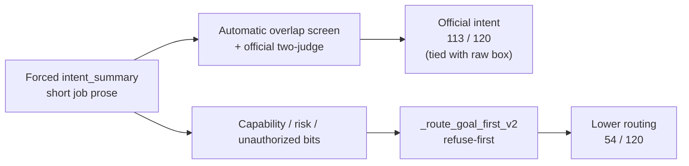

# 5. Results

This chapter answers the research question with evidence and explains the mechanisms. The study default temperature is **0.7**; primary manager comparisons use the unified fix-stack emit at that default (job **55670**). Official two-judge intent remains available only from the **temperature-0 final-close** protocol and is cited as T0 protocol evidence for H1 — not as a T0.7 two-judge result. Lower temperatures (**0.0, 0.3, 0.5**) are an ablation against 0.7; temperature **1.0** is **[Results Incoming]**. Mechanism deep-dives that were measured on the T0 matched set (the **62**, CA-0007, confusion heatmaps) are labelled as such. Every table keeps the locked system order.

**Field rule for this chapter.** Automatic overlap and two-judge intent are reported only on dedicated job boxes (`intent_summary`). An older lexical screen on free-form reasoning (68 / 60) was a temporary gauge before those boxes existed; it is **not** used in the scoreboard or figures below.

---

## 5.1 The story in one page

| # | Finding |
|---:|---|
| 1 | At study default **T0.7**, manager routing is GF **54**, degree **57**, timid **29**, blind **21** / 120; intent auto screen **117 / 120**; CPC F1 ~**0.113**; risk-sensitive **32 / 53**; capability **0.442** |
| 2 | Official two-judge is still **only at T0** (**113 = 113** GF vs raw) — H1 Rejected on that protocol; absolute writing strong. Official intent at 0.7 is **[Results Incoming]** |
| 3 | H2 Rejected at T0.7: GF **54** does not beat historically raw **88** (T0) and barely vs degree **57** |
| 4 | Dissociation remains: the router does not check whether the intent box matched gold. On the T0 matched set, **62** automatic-overlap passes still mis-route (46 refuse / 13 ask / 3 execute) |
| 5 | H3 ablation (0.0 / 0.3 / 0.5 vs **0.7**): GF routing **54, 47, 51, 54** — flat / not rescued by cooling; intent screen **112, 108, 117, 117**. Degree peaks at 0.5 (**69**) then **57** at 0.7 |
| 6 | Wording still **0 / 23** (**[FIXABLE]**); ambiguity exact-set ~**2 / 120** (**[LIMITATION]**; soft F1 ~0.41). Failed rows repair **56191** = **[FIXABLE]**. T1.0 (H4) **[Results Incoming]** |

*Figure 1. Automatic-overlap screen on the same field for every system: `intent_summary` (Jaccard ≥ 0.18). Panel reflects the T0 matched-set screen where raw / fine-tune boxes were available; at T0.7 the shared-analysis screen is **117 / 120**.*

**Discussion.** Figure 1 is a corroborating screen, not the official primary. At T0, once raw and fine-tune also emit a short job box, the cheap screen is near ceiling (**120 / 120** and **119 / 120**) while goal-first is **112 / 120**. At the study default T0.7 the unified fix-stack screen rises to **117 / 120**, but that is still not two-judge. Official primary remains two-judge (T0 final-close only so far; Section 5.3).

*Figure 2. Left: official two-judge intent (T0) beside secondary routing. Right: goal-first automatic screen split into the four intent×route cells (T0 matched set).*

**Discussion.** The left panel is the study’s headline dissociation measured where two-judge exists: raw and goal-first both reach **113 / 120** official intent at T0, but routing diverges (**88** vs **54**). At T0.7 the same routing weakness appears for managers (GF **54** vs degree **57**). The right panel shows where goal-first’s automatic passes go on the T0 set: **62** rows name the job under the cheap screen and still take the wrong route. That slab is the mechanism chapter (Section 5.5), not a claim that intent failed.

*Figure 3. Secondary outcome: routing correctness. Live six-system panel uses the completed T0 matched set; T0.7 manager counts are in Section 5.3.*

**Discussion.** Routing is where write-then-route currently loses. At T0, raw and fine-tune lead; degree (never refuse) edges goal-first; timid and context-blind collapse. At T0.7 the manager order is similar (**54 / 57 / 29 / 21**). Context-blind’s **21 / 120** is not “safer understanding” — it is refuse-heavy behaviour after the capability card is withheld. Significance for H2: the risk-aware router does **not** beat historically raw routing or the simpler degree policy.

---

## 5.2 How goal-first reaches strong intent — and why that is not a win over raw

| Step | What happens | Effect on score |
|---|---|---|
| 1 | Prompt forces a dedicated job paragraph | Writing is scored on a clean field |
| 2 | Scene nouns land in that paragraph | Automatic overlap **112 / 120** at T0; **117 / 120** at T0.7 |
| 3 | Two-judge check on the same box | **113 / 120** official intent (**T0 final-close only**) |
| 4 | Raw / fine-tune also emit `intent_summary` (final-close intent-box run) | Automatic **120 / 119**; two-judge **113 / 107** at T0 |
| 5 | Router never asks “did the box match gold?” | Route uses capability / unauthorized / risk bits |
| 6 | Those bits are often wrong (capability **0.425** at T0; **0.442** at T0.7) | Intent stays high; routing collapses (**54 / 120** at both T0 salvage and T0.7) |

**Which intent number to trust?** Official primary = **two-judge** (available at T0 only so far). Automatic overlap is a screen on the **same** `intent_summary` field. Do not revive the old reasoning-field 68 / 60 numbers in comparisons. Do not invent a T0.7 two-judge score.

---

## 5.3 Intent and routing scoreboard

### Study default T0.7 — manager systems (unified fix-stack)

Primary scoreboard at the study default. Source: unified job **55670** pulls (`outputs/cluster_pulls/unified_55670/`; see `EVIDENCE_BRIEF.md` / `report_numbers.json`). Two shared failed IDs (CA-0292, CA-0963) count as incorrect; repair **56191** is **[FIXABLE]**.

| System | Automatic overlap on `intent_summary` *(screen)* | **Two-judge intent *(official)*** | Routing *(secondary)* |
|---|---:|---:|---:|
| New goal-first | **117 / 120** | **[Results Incoming]** | **54 / 120** |
| New degree | **117 / 120** (shared analysis) | **[Results Incoming]** | **57 / 120** |
| New timid | **117 / 120** (shared analysis) | **[Results Incoming]** | **29 / 120** |
| New context-blind | 115 / 120 (blind generation) | **[Results Incoming]** | **21 / 120** |
| Raw Qwen / Fine-tune at T0.7 | — | — | **[Results Incoming]** (no matched T0.7 raw/FT routing emit in this pack) |

**Supporting metrics at T0.7 (goal-first).** CPC micro-F1 **~0.113**; wording **0 / 23** (**[FIXABLE]**); ambiguity exact-set **2 / 120** (**[LIMITATION]**; micro-F1 **~0.411**); risk-sensitive **32 / 53**; capability accuracy **0.442**.

**H2 reading at default.** Goal-first **54** does not beat historically raw **88** (T0 matched) and does not clearly beat degree **57**; it does beat timid **29** and blind **21**.

### Official two-judge — T0 final-close only (H1 protocol)

Official two-judge remains **T0 final-close only**. Do **not** read this table as “T0.7 two-judge.” Manager routing in the right column uses the local r1 salvage (VERIFY_PASSED) for the matched T0 set.

| System | Automatic overlap on `intent_summary` *(screen)* | **Two-judge intent *(official)*** | Routing *(secondary)* |
|---|---:|---:|---:|
| Raw Qwen | **120 / 120** (intent-box emit) | **113 / 120** (same box) | **88 / 120** |
| Fine-tune | **119 / 120** (intent-box emit) | **107 / 120** (same box) | 87 / 120 |
| New goal-first | 112 / 120 | **113 / 120** | **54 / 120** |
| New degree | 112 / 120 (shared analysis) | 113 / 120 (shared analysis) | 59 / 120 |
| New timid | 112 / 120 (shared analysis) | 113 / 120 (shared analysis) | 26 / 120 |
| New context-blind | — (separate blind generation) | **108 / 120** (blind box) | 21 / 120 |

**H1 reading.** Rejected as superiority over raw: two-judge **tie 113 = 113** at T0. Absolute writing is still strong. Official intent at the study default 0.7 remains **[Results Incoming]**.

### Lower-temperature ablation vs 0.7 (H3)

| Temp | Goal-first | Degree | Timid | Blind | Intent auto (shared) | Source / caveat |
|---:|---:|---:|---:|---:|---:|---|
| **0.0** | **54** | **59** | 26 | 21 | 112 | Local r1 salvage (pre-fix / T0 protocol base) |
| **0.3** | **47** | **56** | 25 | 21 | 108 | Mega R1 pre-fix; raw/FT routing 82 / 79 |
| **0.5** | **51** | **69** | 23 | 21 | **117** | Unified **55670** fix stack |
| **0.7** | **54** | **57** | 29 | 21 | **117** | Unified **55670** (**study default**) |
| **1.0** | — | — | — | — | — | **[Results Incoming]** (H4; ~91/120 mid-run) |

**Provisional H3.** Lowering temperature does **not** materially improve goal-first routing versus 0.7 (flat **54 / 47 / 51 / 54**). Intent screen at 0.5/0.7 (**117**) is higher than mega 0.3 (**108**) and salvage 0.0 (**112**), with the caveat that stack mix (pre-fix mega vs unified fix-stack) confounds a pure temperature claim. Degree peaks at **T0.5 (69 / 120)** then falls to **57** at 0.7. Blind stays at **21**.

**Failed rows (repairable).** T0.5: CA-0070, CA-0211 (`bad_intent_summary`). T0.7: CA-0292 (`bad_intent_summary`), CA-0963 (`uncertainty_out_of_range`). Shared analysis → three systems fail per ID. Repair job **56191** queued `afterany:55670` — **[FIXABLE]**.

### Supporting metrics across temperatures

| Metric | T0 salvage | T0.5 unified | T0.7 unified (default) |
|---|---:|---:|---:|
| Capability accuracy (GF) | 0.425 | 0.408 | **0.442** |
| Ambiguity micro-F1 (GF) | ~0.20 | **0.420** | 0.411 |
| Ambiguity exact-set (GF) | 0 / 120 | 0 / 120 | **2 / 120** |
| CPC micro-F1 (GF) | 0.045 | **0.119** | **0.113** |
| Clarification wording / 23 | 0 / 23 | **0 / 23** | **0 / 23** |
| Risk-sensitive (GF, 53) | 26 / 53 | 30 / 53 | **32 / 53** |

### Comparability notes (from the records)

| Note | What the records show |
|---|---|
| Study default centre | Manager routing / screen / CPC / risk at **T0.7** first. |
| Official primary intent | Two-judge column only (**T0 final-close**). Non-T0 two-judge = **[Results Incoming]**. |
| Same-field automatic screen | Raw 120 / fine-tune 119 / goal-first 112 at T0; shared GF **117** at T0.5/T0.7. |
| Historical 68 / 60 | Reasoning-field gauge. **Dropped.** |
| Two counts of 113 | Disjoint miss lists. Goal-first: CA-0149, CA-0245, CA-0470, CA-0552, CA-0714, CA-0846, CA-0923. Raw: CA-0058, CA-0225, CA-0226, CA-0262, CA-0426, CA-0762, CA-0878. |
| Routing 54 / 57 / 29 at T0.7 | Shared analysis; three Python routers (+ blind second generation). |
| Mixing mega 0.3 with unified 0.5/0.7 | OK for provisional H3 trends; disclose stack mix. |
### Intent × routing heatmap (automatic-overlap screen on goal-first)

*Figure 3b. Automatic-overlap intent versus routing on goal-first (N = 120; **T0 matched set**).*

**Discussion.** The dark cell (**62**) is the dissociation mass measured at T0: the cheap screen says the job was named, yet the route missed gold. The off-diagonal cells with intent-no (**4 + 4**) are small — most routing errors are not “failed to write the job.” Gold-execute rows where the box still looked like the job under automatic overlap: **71 / 76**. The same refuse-first story is the leading account of why T0.7 routing stays at **54 / 120**.

---

## 5.4 Case study: correct intent, incorrect route

**CA-0007.** Command: “Can the selected controlled medicine tray be delivered after a scheduled meal service?”  
Follow-up from the nurse: treat the utterance as a delivery request rather than a capability question.

Gold job (short): deliver the selected controlled medicine tray after the 11:00 meal service.  
Gold route: clarify (two trays are pending and no recipient is named in the command).

| System | Intent (automatic overlap on box) | Route | Mechanism |
|---|---|---|---|
| New goal-first | Yes (0.275); names delivery after 11:00 | Refuse | `known_unsafe_or_prohibited`; pilot `unauthorized`; live risk `low` |
| New degree | Same `intent_summary` | Execute | Degree never refuses |
| New timid | Same `intent_summary` | Clarify | Matches gold |
| Raw Qwen | Yes on `intent_summary` intent box | Execute | Also routing-wrong versus gold clarify |

**Discussion.** The paragraph names the delivery job. The refuse-first router never reads that success; it fires on the unauthorized bit. Holding writing fixed and swapping only the Python policy moves the route (refuse → execute → clarify). That is policy error, not missing intent.

---

## 5.5 The 62: intent yes, routing no

**Definition.** Rows where automatic overlap on goal-first `intent_summary` passes (≥ 0.18, no polarity flip) **and** goal-first routing ≠ gold. Defined on the automatic screen, not on two-judge. **Measured on the T0 matched set** (the deep-dive emit where the full intent×route contingency and rule breakdown were computed). The same refuse-first mechanism is the leading explanation for weak T0.7 routing (**54 / 120**), even though the exact “62” count is a T0 statistic.

*Figure 4. Live rules among the 62 intent-yes / routing-no rows.*

**Discussion.** The mass is refuse-first: `known_incapable` and `known_unsafe_or_prohibited`. Significance: after the job is named, the stack still trusts capability / unauthorized fields that are frequently wrong. This figure is the visual form of H2’s failure mode, not a wording or intent-box failure. Status of the underlying bits: **future science** (router recalibration), not a small emit patch.

*Figure 5. Refuse vs ask vs wrong execute inside the 62.*

**Discussion.** Do not call this slab “62 over-asks.” **46** are refuses, **13** asks, **3** wrong executes. The ask slice is real but secondary; the refuse slice is the dominant story and matches the gold-execute → refuse mass in the confusion heatmaps (Figure 11).

### What happened

| Stage | Count / fact | Meaning |
|---|---:|---|
| Intent-yes / routing-no | **62** | Dissociation slab |
| Refuse | **46** | Main failure mode |
| Ask (`default_clarify`) | **13** | Still wrong versus gold |
| Wrong execute (`context_licensed_execute`) | **3** | CA-0225, CA-0512, CA-0798 |
| Of refuses: `known_incapable` | **36** | Gold capable **34**, conditional **2**, incapable **0** |
| Of refuses: `known_unsafe_or_prohibited` | **10** | Live risk **low**, gold **capable**, pilot `unauthorized` |

**Mechanistic chain.**

1. Forced `intent_summary` often matches gold under Jaccard and under two-judge.
2. `_route_goal_first_v2` ignores that match and reads capability / pilot / risk / speech-act bits.
3. Thirty-six intent-correct rows stamp `incapable` while gold is capable or conditional → refuse. Justified incapable in that slice: **0**.
4. Ten more stamp `unauthorized` at live low risk → refuse; timid asks all ten.
5. Residuals: `default_clarify` (13) or wrong execute (3).

### Policy ablation with analysis held fixed

Counts below are from the **T0 matched set** (mechanism ablation). At study default **T0.7** the same policy order is GF **54** / degree **57** / timid **29** / blind **21**.

| System | Policy | Routing (T0 matched) |
|---|---|---:|
| Goal-first | Refuse-first on incapable / unauthorized / high-risk unsafe | **54 / 120** |
| Degree | Uncertainty thresholds; cannot refuse | **59 / 120** |
| Timid | Ask unless clean execute license fires | **26 / 120** |
| Context-blind | Same refuse-first rules on a blind second generation | **21 / 120** |

| Extra fact | Number |
|---|---:|
| Degree gold-refuse recall | **0 / 21** |
| Timid false asks | 55 |
| Context-blind capable recall | **0** |
| Context-blind refuses of gold-execute | 75 / 76 |

*Figure 6. Capability-bit accuracy on the T0 matched set: goal-first **0.425** versus raw ≈ **0.667**. At T0.7 unified, GF capability rises to **0.442** but routing stays at **54 / 120**.*

**Discussion.** The router consumes this bit. Lower capability accuracy is not a cosmetic secondary metric — it is the direct input to the refuses that dominate the 62. Status: calibration / modelling **limitation of the current stack**, addressed by future router work rather than wording/CPC emit alone.

*Figure 7. Wrong “cannot” / “unauthorized” bits pushing refuses after a usable intent box.*

**Discussion.** Read with Figure 4: when the bit is wrong, refuse-first converts a good intent paragraph into a wrong handling path. CA-0007 is the case form of this panel.

---

## 5.6 Clarification: asking versus asking well

*Figure 8. Ask-label precision–recall (did the system press Ask?).*

**Discussion.** Raw / fine-tune lead on ask-label F1. Goal-first family under-asks or asks for the wrong reason relative to gold. Ask-label is separate from wording quality: a system can press Ask and still emit an unusable question string.

| System | Ask-label F1 | Wording correct / 23 |
|---|---:|---:|
| Raw Qwen | **0.557** | 0 / 23 |
| Fine-tune | 0.540 | 0 / 23 |
| New goal-first | 0.286 | 0 / 23 |
| New degree | 0.253 | 0 / 23 |
| New timid | 0.286 | 0 / 23 |
| New context-blind | 0.000 | 0 / 23 |

### Clarification wording of 0 / 23 — **[FIXABLE]**

Already scored on CPU. **Not** on mega 54259. Unified job **55670** carries generator **1.1.0** on re-emit (older fix-emit packaging **54774** / failed **54833** superseded).

| What happened on 23 gold-ask rows | Count | Wording credit |
|---|---:|---|
| Refused | 14 | 0 |
| Executed instead of asking | 3 | 0 |
| Asked (slot-name templates) | 6 | **still 0** |

Empty `candidate_interpretations` on all 120 rows forced slot-name templates. Official score stays **0 / 23** until new questions are emitted.

---

## 5.7 Slot binding (CPC) and risk — including low-stakes rows

| System | CPC F1 *(micro-F1)* | Risk-sensitive decision **accuracy** (53 medium+high) |
|---|---:|---:|
| Raw Qwen | — (no filled CPC cells) | **0.736** (39 / 53) |
| Fine-tune | — | 0.755 (40 / 53) |
| New goal-first | **0.045** | 0.491 (26 / 53) |
| New degree | 0.045 | 0.434 (23 / 53) |
| New timid | 0.045 | 0.245 (13 / 53) |
| New context-blind | — | 0.377 (20 / 53) |

### Why medium+high is a separate exam — and what happens on low

Gold risk labels: **64** low, **34** medium, **19** high, **3** unknown, **0** none. The risk-sensitive accuracy uses only the **53 medium+high** rows so the headline risk number emphasises higher-stakes mistakes. That design choice is deliberate, but it is **not** a claim that low-stakes rows do not matter.

Low-risk rows remain inside ordinary routing. On the **64 low** rows alone:

| System | Low-risk routing correct | Rate |
|---|---:|---:|
| Raw Qwen | **46 / 64** | 0.719 |
| Fine-tune | **45 / 64** | 0.703 |
| New degree | **35 / 64** | 0.547 |
| New goal-first | **27 / 64** | 0.422 |
| New timid | **11 / 64** | 0.172 |
| New context-blind | **0 / 64** | 0.000 |

**Discussion.** Goal-first is already weak on low-stakes routing (**27 / 64**), not only on the 53-row risk exam. Several of the ten `unauthorized` refuses inside the 62 are live **low** risk (including CA-0007): the stack treats low-stakes capable jobs as prohibited. Context-blind’s **0 / 64** shows that withholding the card destroys low-stakes execute decisions entirely. So excluding low from the *restricted* risk accuracy is a focus choice; the low-stakes behaviour is still analysed here and still counts against H2.

### CPC F1 — improved under fix stack at T0.7, still weak

At the study default, unified T0.7 CPC micro-F1 is **~0.113** (T0.5: **0.119**). Historical T0 salvage was **0.045**. Wording remains **0 / 23** on those emits (**[FIXABLE]** / unresolved). Cluster `scores/` dirs were empty during 55670 (sidecar step under `|| true`); cite local recompute until cluster files land. Fix-reemit of T0.0 / T0.3 and repair job **56191** still Incoming.

| Quantity | Count |
|---|---:|
| Gold filled cells | 678 |
| Pred cells with `status == filled` | 78 (only 6 / 120 rows) |
| True / false / false-neg | 17 / 61 / 661 |
| Official micro-F1 | **0.045** |

Usable values stamped `unknown` / `not_applicable` are ignored by the official scorer. Unified job **55670** includes prompt + parse coerce (`unknown` + non-empty value → `filled`).

| Risk / reject | Raw | Goal-first | Degree | Context-blind |
|---|---:|---:|---:|---:|
| Risk-sensitive decision accuracy (53) | **0.736** | 0.491 | 0.434 | 0.377 |
| Gold-refuse recall | **21 / 21** | 17 / 21 | **0 / 21** | 21 / 21* |

\*Context-blind also refuses almost all gold-execute rows.

---

## 5.8 Ambiguity tags and speech acts

| Metric | New goal-first | Raw Qwen |
|---|---:|---|
| Ambiguity exact-set | **0 / 120** | 0 / 120 |
| Ambiguity macro-F1 | 0.246 | 0.077 |
| Capability accuracy | 0.425 | 0.667 |

*Figure 9. Ambiguity tagging errors on the frozen emit (exact-set 0 / 120).*

**Discussion.** Soft overlap already exists on **62 / 120** rows (micro-F1 ≈ 0.215 on the frozen T0 emit), so the system is not emitting empty bags. Exact-set fails because bags binge `action_order` and miss gold-heavy classes. At T0.7 unified, exact-set is still only **~2 / 120** while soft micro-F1 rises to **~0.41** — treat exact-set as a **[LIMITATION]**, not a solved metric. Two layers: (1) tagging quality; (2) constrained-prompt vocab omission on **111 / 120** R1 rows — fixed in code and carried on unified job **55670**. Status: **[FIXABLE]** for the prompt bug; residual exact-set difficulty remains a soft **[LIMITATION]** even after re-emit (old manager ceiling ≈ 8 / 120).

---

## 5.9 Stability and confusion

*Figure 10. Replica agreement for routing on the completed temperature-0 set.*

**Discussion.** Stability asks whether the routing story is a one-off draw. High replica agreement supports treating the 54 / 120 routing result as a reproducible property of the stack at temperature 0, not noise.

*Figure 11. Confusion matrices; goal-first gold-execute → refuse is the visual form of the 62.*

**Discussion.** The off-diagonal mass from gold execute into refuse is the same mechanism as Figures 4–7. It is the strongest single picture of why H2 fails while intent writing stays high.

*Figure 12. Per-route accuracy / F1 support by system.*

**Discussion.** Aggregate routing hides class imbalance. This panel shows which handling paths each system can actually hit. Degree’s zero gold-refuse recall and timid’s ask inflation appear here as class-level pathology, not just a lower total.

*Figure 13. Intent automatic-overlap screen and routing versus decoding temperature (0.0, 0.3, 0.5, 0.7). T1.0 still Incoming.*

**Discussion.** This is the visual form of the H3 ablation in Section 5.3. Goal-first routing is nearly flat across 0.0–0.7 versus the study default; the intent screen lifts at unified 0.5/0.7; degree’s spike at 0.5 is the clearest temperature-sensitive routing movement so far. Fill T1.0 (H4) when job **55670** finishes.

---

## 5.10 What is finished versus incoming

Full cluster inventory: [[10-cluster-results-status]]. Cite pack: `outputs/cluster_pulls/unified_55670/EVIDENCE_BRIEF.md` and `report_numbers.json`.

| Item | Status |
|---|---|
| T0.7 manager routing / intent screen / capability / CPC / risk-sensitive | **Done** (study default; 2 failed IDs; repair **56191** queued) |
| T0 two-judge + salvage routing / low-risk / capability (H1 protocol) | **Done** |
| Lower-T ablation 0.0 / 0.3 / 0.5 vs 0.7 (H3 routing + screen) | **Done** (provisional; stack-mix caveat) |
| T0.3 mega routing + intent screen + raw/FT routing | **Done** (pre-fix; usable for temp trends) |
| T1.0 unified emit (H4) | **Incoming** (~91/120; job **55670** RUNNING) |
| Fix-reemit T0.0 / T0.3 under fix stack | **Incoming** (still in **55670** queue after T1.0) |
| Repair failed rows T0.5/T0.7/(T1.0)/0.0/0.3 | **Queued** — job **56191** `afterany:55670` (**[FIXABLE]**) |
| Two-judge at non-T0 temps (incl. official intent at 0.7) | **[Results Incoming]** |
| Wording 0 / 23 | Still **0 / 23** on unified emits — **[FIXABLE]** / unresolved |
| Ambiguity exact-set | ~**2 / 120** at T0.7 — **[LIMITATION]** (soft F1 improved) |
| Temperature line graph | **Filled** for 0.0–0.7; T1.0 open |
| H1 improvement pass | **TODO after jobs** |

**Per-temperature markers:**

| T | Marker |
|---:|---|
| 0.0 | Ablation cite (salvage) · fix-reemit still Incoming via 55670 |
| 0.3 | Ablation cite (mega) · fix-reemit Incoming |
| 0.5 | Ablation cite (unified; repair pending for CA-0070, CA-0211) |
| **0.7** | **Study default — Done** (unified; repair pending for CA-0292, CA-0963) |
| 1.0 | **Incoming** (~91/120 on **55670**) — H4 |

---

## 5.11 Relation to the research question

| Supported | Rejected / pending |
|---|---|
| Write-then-route produces strong intent writing (T0 two-judge **113 / 120**; T0.7 auto **117 / 120**) | H1 as stated (“more often than raw”): **not supported** — T0 two-judge tied 113 / 113; official at 0.7 **[Results Incoming]** |
| Shared-analysis routers move routing at T0.7 (**54 / 57 / 29**) without rewriting the intent box | H2: goal-first beats raw on routing — **Rejected** (54 vs historically raw 88; barely vs degree 57) |
| Miscalibrated capability / unauthorized fields explain most of the T0 **62** | Wording / CPC zeros imply intent failure |
| Lowering T does not rescue GF routing vs 0.7 (H3 provisional) | Withholding context improves safety |
| | H4 (T1.0): **[Results Incoming]** |

**H1.** **Rejected** as superiority over raw on the only official protocol available (T0 two-judge **113 = 113**). Absolute writing remains strong; official intent at **0.7** is **[Results Incoming]**.  
**H2.** **Rejected** at study default: T0.7 GF routing **54** vs historically raw **88**; also vs degree **57** / timid **29**.  
**H3.** **Provisional: not supported** — GF routing flat across 0.0–0.7; intent screen higher at unified 0.5/0.7 than mega 0.3 (stack-mix caveat).  
**H4.** **[Results Incoming]** until T1.0 finishes.  
Router recalibration remains future work so that strong intent writing is not discarded by refuse-first policy.

---

## 5.12 Sufficiency of Pilot-120 for the observed pattern

| Pattern | Evidence |
|---|---|
| Intent–policy dissociation | Official intent 113 versus routing 54; 62-row slab |
| Policy-only ablation | Shared analysis yields 54 / 59 / 26 |
| Unjustified incapable refuses | 34 of 36 such refuses are gold-capable |
| Low-stakes weakness | Goal-first 27 / 64 low-risk routing; several unauthorized refuses at live low risk |
| Context dependence | Context-blind capable recall 0; low-risk routing 0 / 64 |

N = 120 is sufficient to establish these regularities. Larger sets can test generality later.
