# 5. Results

This chapter answers the research question with evidence and explains the mechanisms. Unless marked **[Results Incoming]**, system-comparison counts are from the completed temperature-0 matched set (live v2 R1). The study default temperature is **0.7**; those centred tables are still arriving. Every table keeps the locked system order.

---

## 5.1 The story in one page

| # | Finding |
|---:|---|
| 1 | Forced `intent_summary` reaches official two-judge intent **113 / 120** |
| 2 | The same stack’s routing is weaker than raw Qwen (**54 / 120** vs **88 / 120**) |
| 3 | Dissociation: the router never consults whether the intent box matched gold; it trusts capability / unauthorized bits |
| 4 | On 62 automatic-overlap passes, routing still fails (46 refuse / 13 ask / 3 execute) |
| 5 | Wording **0 / 23** and CPC F1 **0.045** are **[FIXABLE]** by a separate re-emit (not mega 54259) |
| 6 | Temperature-0.7 scoreboard and H3/H4 | **[Results Incoming]** |

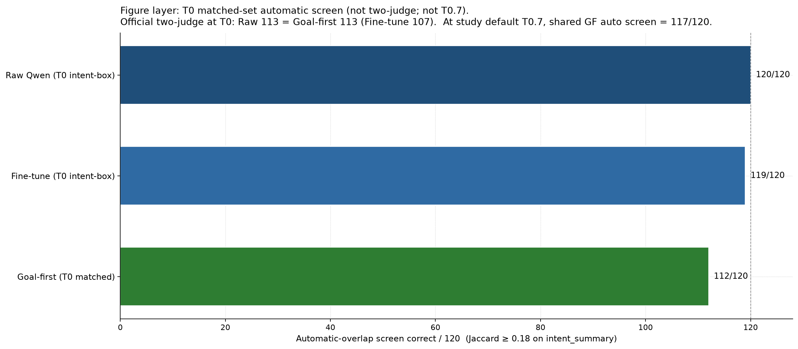

*Figure 1. Intent writing exams. Automatic overlap screens different fields across systems (Section 5.3). Official intent for systems with an intent box is the two-judge protocol.*

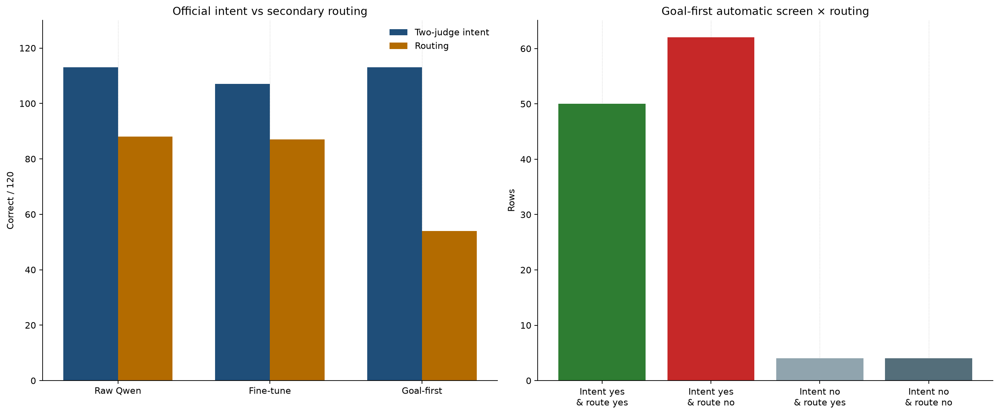

*Figure 2. Official/primary intent beside secondary routing. The highlighted region marks 62 rows with correct automatic-overlap intent and incorrect routing.*

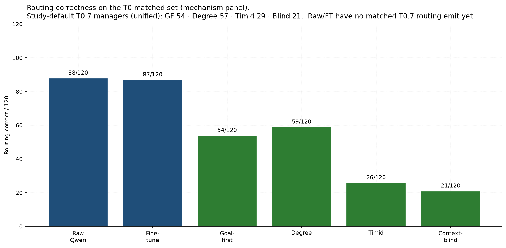

*Figure 3. Secondary outcome: routing correctness. Context-blind routing of 21 / 120 coincides with gold refuse support under a refuse-heavy policy.*

---

## 5.2 How goal-first reaches strong intent

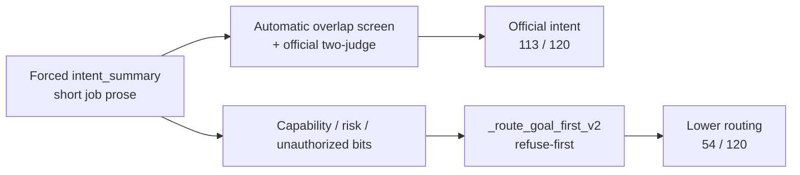

| Step | What happens | Effect on score |
|---|---|---|
| 1 | Prompt forces a dedicated job paragraph first | Writing is scored on a clean field |
| 2 | Scene nouns land in that paragraph | Automatic overlap ≥ 0.18 often passes (**112 / 120**) |
| 3 | Two-judge check on the same box | **113 / 120** — official primary intent |
| 4 | Router never asks “did the box match gold?” | Route uses capability / unauthorized / risk bits |
| 5 | Those bits are often wrong (capability accuracy **0.425**) | Intent stays high; routing collapses |

**Which intent number to trust?** Use **two-judge 113 / 120** as the official primary result for goal-first. Automatic overlap **112 / 120** is a corroborating screen on the same `intent_summary` box. Raw Qwen’s automatic overlap **68 / 120** was scored on long free-form reasoning (no dedicated job box on that earlier emit). Once raw also emits a short intent box, two-judge intent reaches **113 / 120**. The fixed field is what makes the official protocol comparable; the automatic-overlap columns are not interchangeable.

---

## 5.3 Intent and routing scoreboard

Completed temperature-0 matched set (interim head-to-head). Temperature **0.7** tables: **[Results Incoming]**.

| System | Automatic overlap *(screen)* | **Two-judge intent *(official)*** | Routing *(secondary)* |
|---|---:|---:|---:|
| Raw Qwen | 68 / 120 (free-form reasoning field) | **113 / 120** (dedicated intent box) | **88 / 120** |
| Fine-tune | 60 / 120 (free-form reasoning field) | **107 / 120** (dedicated intent box) | 87 / 120 |
| New goal-first | 112 / 120 (`intent_summary`) | **113 / 120** (`intent_summary`) | **54 / 120** |
| New degree | 112 / 120 (`intent_summary`; shared analysis) | 113 / 120 (`intent_summary`; shared analysis) | 59 / 120 |
| New timid | 112 / 120 (`intent_summary`; shared analysis) | 113 / 120 (`intent_summary`; shared analysis) | 26 / 120 |
| New context-blind | — (separate blind generation) | **108 / 120** (blind `intent_summary`) | 21 / 120 |

### Comparability notes (from the records)

| Note | What the records show |
|---|---|
| Official primary intent | Two-judge column only. Automatic overlap is a screen. |
| 112 versus 68 | Different scored fields. Goal-first packs job nouns into `intent_summary` (mean overlap ≈ 0.355). Raw’s 68 uses diluted reasoning text (mean ≈ 0.192). Do **not** subtract 112 − 68 as an understanding gain. |
| Two counts of 113 | Same AND-judge protocol on **different texts**. Miss lists are **disjoint**. Goal-first misses: CA-0149, CA-0245, CA-0470, CA-0552, CA-0714, CA-0846, CA-0923. Raw intent-box misses: CA-0058, CA-0225, CA-0226, CA-0262, CA-0426, CA-0762, CA-0878. Same total does **not** mean the same 113 rows. |
| Routing 54 / 59 / 26 | One model-generated rich analysis is cached and fed to three Python routers (`goal_first_manager_v2`, `degree_based_router_v2`, `rich_conservative_manager_v2`). Routing differences are policy differences, not rewrites of the intent paragraph. Context-blind 21 / 120 uses a **second** generation with scene and capability card withheld. |

### Intent × routing heatmap (automatic-overlap screen on goal-first)

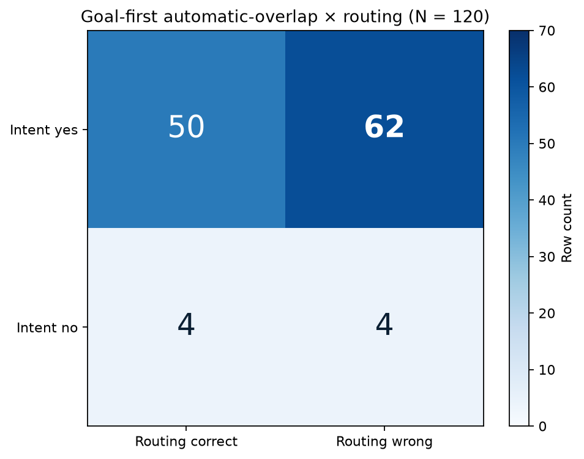

*Figure 3b. Automatic-overlap intent versus routing on goal-first (N = 120). The dark cell is the 62-row dissociation slab.*

| | Routing correct | Routing wrong |
|---|---:|---:|
| Intent yes | 50 | **62** |
| Intent no | 4 | 4 |

Gold-execute rows where the box still looked like the job under automatic overlap: **71 / 76**.

---

## 5.4 Case study: correct intent, incorrect route

**CA-0007.** Command: “Can the selected controlled medicine tray be delivered after a scheduled meal service?”  
Follow-up from the nurse: treat the utterance as a delivery request rather than a capability question.

Gold job (short): deliver the selected controlled medicine tray after the 11:00 meal service.  
Gold route: clarify (two trays are pending and no recipient is named in the command).

| System | Intent (automatic overlap) | Route | Mechanism |
|---|---|---|---|
| New goal-first | Yes (0.275); names delivery after 11:00 | Refuse | Live rule `known_unsafe_or_prohibited`; pilot bit `unauthorized`; live risk `low` |
| New degree | Same `intent_summary` | Execute | Degree never refuses; uncertainty path licenses execute |
| New timid | Same `intent_summary` | Clarify | Conservative ask path matches gold |
| Raw Qwen | Yes on reasoning (0.237) | Execute | Also routing-wrong versus gold clarify |

The intent paragraph names the delivery job. The refuse-first router never reads that success; it fires on the unauthorized bit. Changing only the Python policy changes the route.

---

## 5.5 The 62: intent yes, routing no

**Definition.** Rows where automatic overlap on `intent_summary` passes (≥ 0.18, no polarity flip) **and** goal-first routing ≠ gold. This slab is defined on the automatic screen, not on two-judge.

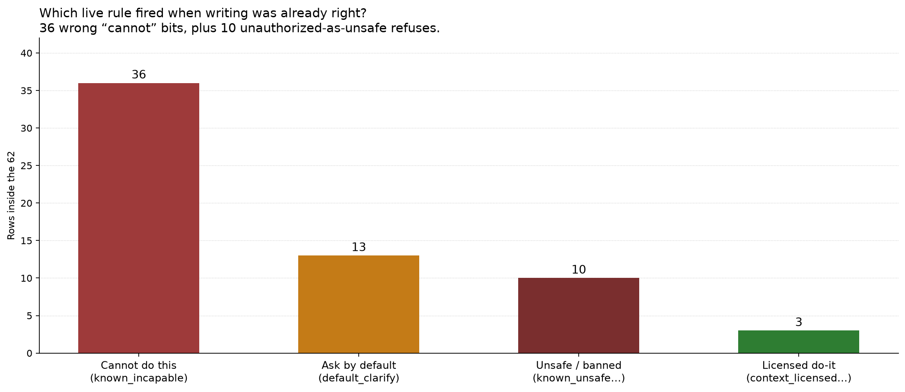

*Figure 4. Why goal-first missed the route after naming the job. Dominated by `known_incapable` and `known_unsafe_or_prohibited`.*

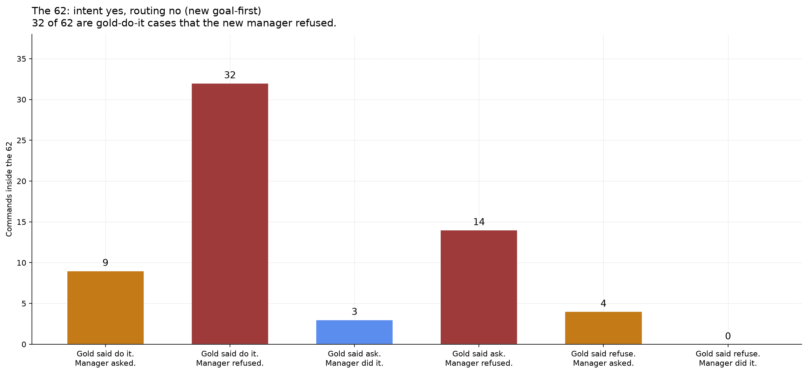

*Figure 5. Breakdown of intent-yes / routing-no behaviour (refuse vs ask vs wrong execute).*

### What happened

| Stage | Count / fact | Meaning |
|---|---:|---|
| Intent-yes / routing-no | **62** | Not “62 over-asks” and not “62 refuses” |
| Refuse | **46** | Main failure mode |
| Ask (`default_clarify`) | **13** | Still wrong versus gold (examples: CA-0058, CA-0086, CA-0105, CA-0851) |
| Wrong execute (`context_licensed_execute`) | **3** | CA-0225, CA-0512, CA-0798 — gold wanted clarify |
| Of refuses: `known_incapable` | **36** | Gold capable **34**, conditionally capable **2**, incapable **0** |
| Of refuses: `known_unsafe_or_prohibited` | **10** | All live risk **low**, gold **capable**, pilot stamped `unauthorized` (includes CA-0007) |

**Mechanistic chain.**

1. The prompt forces `intent_summary`, so the job nouns often match gold under Jaccard and under two-judge.
2. `_route_goal_first_v2` does not check whether that paragraph matched gold. It reads capability, pilot, risk, and speech-act fields.
3. On 36 of the 62, the model stamps `incapable` while gold is capable or conditionally capable. The router refuses first. Justified incapable refuses in that slice: **0**.
4. On another 10, the model stamps `unauthorized` at live low risk. The v2 line `pilot ∈ {unsafe, unauthorized}` refuses. Timid, lacking that disjunct, asks all ten.
5. Residual rows fall through to `default_clarify` (13) or wrongly license execute (3).
6. Gold-route split inside the 62: gold do-it 41 → refuse 32 / ask 9; gold ask 17 → refuse 14 / execute 3; gold refuse 4 → ask 4.

Capability accuracy on the full set is **0.425** (51 / 120), with capable recall **0.443** (43 / 97). Raw capability accuracy is about **0.667**. The router trusts the weaker bit.

### Policy ablation with analysis held fixed

Goal-first, degree, and timid share one cached rich analysis for each row. Only the Python policy changes.

| System | Policy | Routing |
|---|---|---:|
| Goal-first | Refuse-first on incapable / unauthorized / high-risk unsafe | **54 / 120** |
| Degree | Uncertainty thresholds; allowed routes exclude refuse | **59 / 120** |
| Timid | Ask unless the clean execute license fires | **26 / 120** |
| Context-blind | Same refuse-first rules on a blind second generation | **21 / 120** |

| Extra fact | Number |
|---|---:|
| Degree gold-refuse recall | **0 / 21** |
| Timid false asks | 55 |
| Context-blind capable recall | **0** |
| Context-blind refuses of gold-execute | 75 / 76 |

Concrete splits on shared analysis: CA-0029 is refuse under goal-first (`known_incapable`) but execute under degree; CA-0007 is refuse under goal-first and clarify under timid; CA-0086 is clarify under all three on a gold-refuse row because degree cannot refuse.

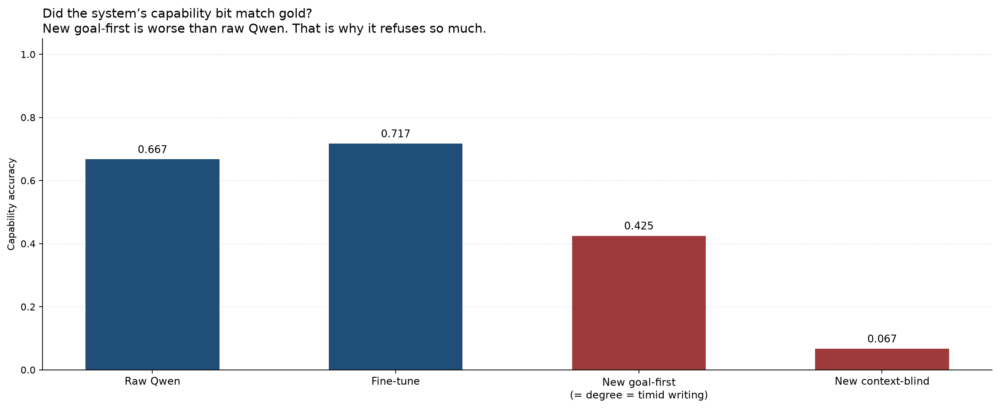

*Figure 6. Goal-first capability accuracy (0.425) is worse than raw (0.667). The router trusts this bit.*

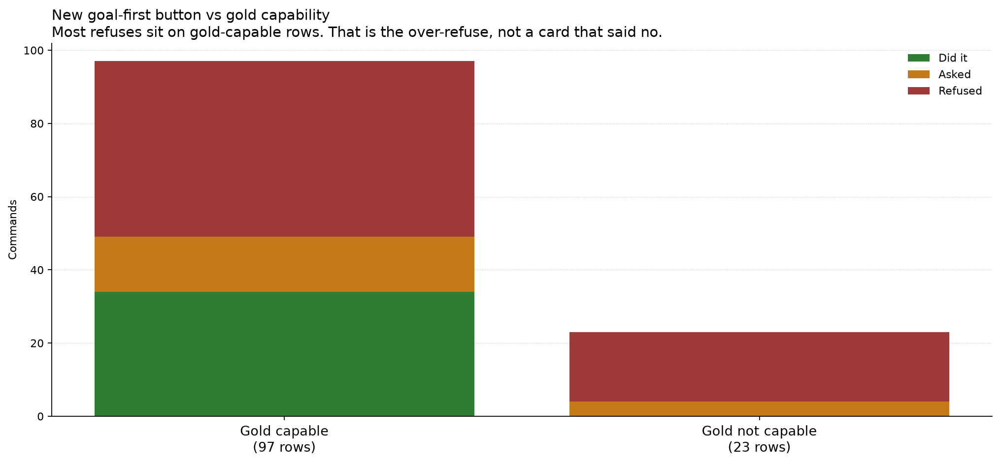

*Figure 7. Wrong “cannot” / “unauthorized” bits push refuses even when the job box is right.*

---

## 5.6 Clarification: asking versus asking well

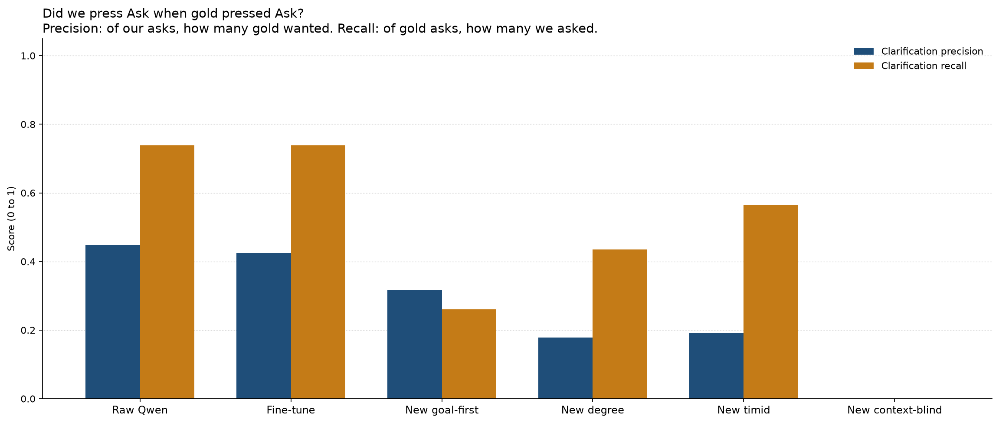

*Figure 8. Ask-label precision–recall.*

| System | Ask-label F1 | Wording correct / 23 |
|---|---:|---:|
| Raw Qwen | **0.557** | 0 / 23 (no licensed question string on that emit) |
| Fine-tune | 0.540 | 0 / 23 |
| New goal-first | 0.286 | 0 / 23 |
| New degree | 0.253 | 0 / 23 |
| New timid | 0.286 | 0 / 23 |
| New context-blind | 0.000 | 0 / 23 |

Ask-label: did we press Ask? Wording: did the question name the licensed alternatives?

### Clarification wording of 0 / 23 — **[FIXABLE]**

Already scored on CPU against the official wording sidecar. **Not** awaiting the GPU temperature sweep, and **not** on mega job 54259 (mega skips wording/CPC).

| What happened on 23 gold-ask rows | Count | Wording credit |
|---|---:|---|
| Refused | 14 | 0 |
| Executed instead of asking | 3 | 0 |
| Asked (slot-name templates) | 6 | **still 0** |

| Cause | Detail |
|---|---|
| Generator needs | Two filled values in `candidate_interpretations` |
| Live v2 emitted | Empty candidates on **all 120** rows |
| Result | Falls back to slot-name templates (“Could you clarify the spatial relation?”) instead of licensed alternatives |
| Unofficial 1.1.0 replay | ~**2 / 23** on the six asked rows only |
| Frozen official score | Remains **0 / 23** until a new emit produces questions |

A follow-on GPU re-emit with generator **1.1.0** is packaged as `cluster/pilot120_fix_emit_20260915/` and is intended to queue behind mega 54259.

---

## 5.7 Slot binding (CPC) and risk

| System | CPC F1 *(micro-F1)* | Risk-sensitive decision **accuracy** (53 medium+high) |
|---|---:|---:|
| Raw Qwen | — (no filled CPC cells) | **0.736** (39 / 53) |
| Fine-tune | — | 0.755 (40 / 53) |
| New goal-first | **0.045** | 0.491 (26 / 53) |
| New degree | 0.045 | 0.434 (23 / 53) |
| New timid | 0.045 | 0.245 (13 / 53) |
| New context-blind | — | 0.377 (20 / 53) |

**Risk denominator.** Gold risk labels are 64 low, 34 medium, 19 high, 3 unknown, 0 none. The risk-sensitive exam uses only the **53 medium+high** rows by design. Low-risk rows are scored in ordinary routing, not in this restricted accuracy.

### CPC F1 of 0.045 — **[FIXABLE]**

**CPC** = slot-binding frame (job parameters). **F1** here is **micro-F1** over official gold cells with `status == filled` (678 eligible). Predicted cells count only if they are also marked `filled`.

Already scored on CPU. **Not** awaiting the GPU temperature sweep; **not** on mega 54259.

| Quantity | Count |
|---|---:|
| Gold filled cells | 678 |
| Pred cells with `status == filled` | 78 (only 6 / 120 rows) |
| True / false / false-neg | 17 / 61 / 661 |
| Official micro-F1 | **0.045** |

| Bug | Reading |
|---|---|
| Model writes a usable `value` | Then stamps `unknown` / `not_applicable` |
| Official scorer | Only counts `status == filled` |
| Fix direction | Prompt CRITICAL rule + parse coerce: non-empty value with status `unknown` → `filled` |

| Risk / reject | Raw | Goal-first | Degree | Context-blind |
|---|---:|---:|---:|---:|
| Risk-sensitive decision accuracy (53) | **0.736** | 0.491 | 0.434 | 0.377 |
| Gold-refuse recall | **21 / 21** | 17 / 21 | **0 / 21** | 21 / 21* |

\*Context-blind also refuses almost all gold-execute rows. Unsafe silent-resolve rate is undefined (gold support 0; nobody predicted it).

---

## 5.8 Ambiguity tags and speech acts

| Metric | New goal-first | Raw Qwen |
|---|---:|---|
| Ambiguity exact-set | **0 / 120** | 0 / 120 |
| Ambiguity macro-F1 | 0.246 | 0.077 |
| Capability accuracy | 0.425 | 0.667 |

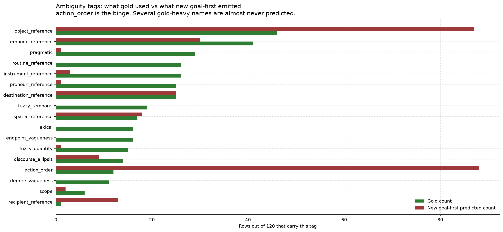

*Figure 9. Ambiguity tagging errors (exact-set stays 0 / 120).*

Exact-set **0 / 120** on the frozen temperature-0 emit is not a missing field and not unfinished GPU sweep work. Soft partial overlap already exists on **62 / 120** rows (micro-F1 ≈ 0.215). Two mechanisms:

| Mechanism | Evidence |
|---|---|
| Tagging quality | Pred bags binge `action_order` (80 false positives) and miss gold-heavy classes (`pragmatic` 29 FN, `routine_reference` 26 FN). Contain-gold = **0 / 120**; CPU drop/normalize lifts exact-set by **0**. |
| Constrained-prompt bug (now fixed in code) | **111 / 120** R1 rows tagged via `schema_constrained_final_emission…` whose prompt previously **omitted** the Pilot-17 names. Thinking listed them; constrained did not. |

Fix-emit job **54774** (behind mega 54259) now carries the repaired constrained prompt (definitions + `action_order` discipline). Treat any later non-zero exact-set as a **new emit**, not a patch of the published 0 / 120. Honest soft metrics (macro/micro-F1, soft overlap) remain reportable today. Raw Qwen’s separate 0 / 120 was mostly empty scored bags (prompt never listed the 17 names); that vocab crash is also fixed in `evaluate_pilot_120_direct_base.py` for the next raw emit.

---

## 5.9 Stability and confusion

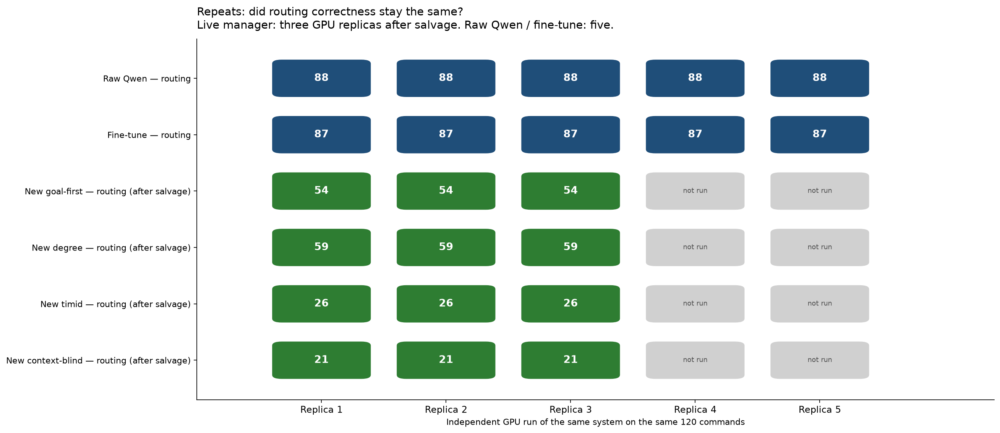

*Figure 10. Replica agreement for routing on the completed temperature-0 set.*

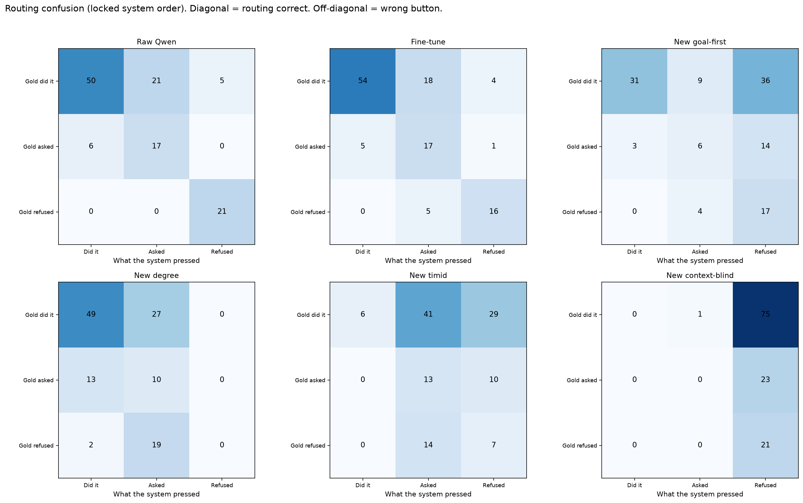

*Figure 11. Goal-first mass of gold-execute → refuse is the visual form of the 62.*

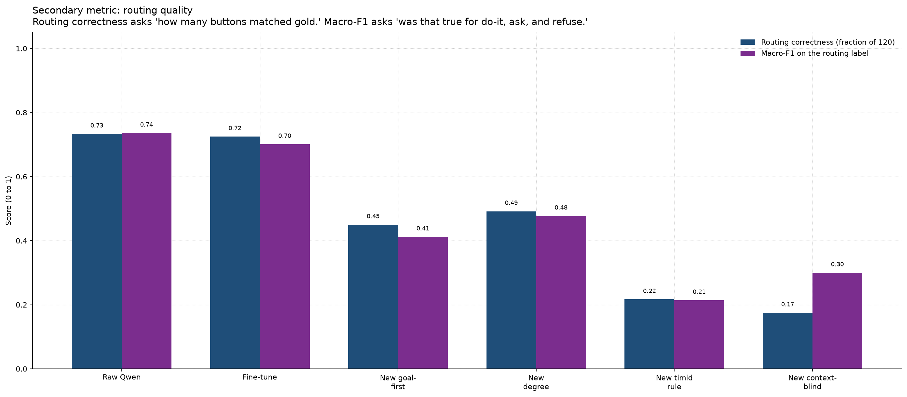

*Figure 12. Per-route view of the same routing story.*

---

## 5.10 What is finished versus incoming

| Item | Status |
|---|---|
| Two-judge intent, routing, risk-sensitive accuracy, ask-label (temperature-0 set) | Done |
| Wording 0 / 23, CPC F1 0.045 | Done on CPU; **[FIXABLE]** by fix-emit behind mega 54259 |
| Ambiguity exact-set 0 / 120 | Frozen emit: tagging quality + constrained-prompt vocab omission; **fix in code on job 54774** |
| Full tables at default temperature **0.7**; H3 / H4 | **[Results Incoming]** |

---

## 5.11 Relation to the research question

| Confirmed | Rejected / pending |
|---|---|
| Official intent writing under write-then-route (two-judge **113 / 120**) | Goal-first beats raw on routing or risk-sensitive decision accuracy |
| Shared-analysis routers move routing (**54 / 59 / 26**) without rewriting the intent box | Degree = better understanding; timid = more careful prose |
| Miscalibrated capability / unauthorized fields explain most of the 62 | Wording / CPC zeros imply intent failure |
| Context-blind collapses capability evidence | Withholding context improves safety |
| | H3 lower-temperature and H4 higher-temperature claims **[Results Incoming]** |

**H1.** Confirmed: official two-judge intent **113 / 120** (automatic overlap screen 112 / 120 on the same box).  
**H2.** Rejected on the completed set: routing 54 / 120 versus raw 88 / 120; risk-sensitive decision accuracy 0.491 versus 0.736.  
**H3 / H4.** **[Results Incoming].**

Router recalibration is future work so that confirmed intent is not discarded by refuse-first policy.

---

## 5.12 Sufficiency of Pilot-120 for the observed pattern

| Pattern | Evidence |
|---|---|
| Intent–policy dissociation | Official intent 113 versus routing 54; 62-row slab |
| Policy-only ablation | Shared analysis yields 54 / 59 / 26 |
| Unjustified incapable refuses | 34 of 36 such refuses are gold-capable |
| Context dependence | Context-blind capable recall 0; routing 21 / 120 |

N = 120 is sufficient to establish these regularities. Larger sets can test generality later.
