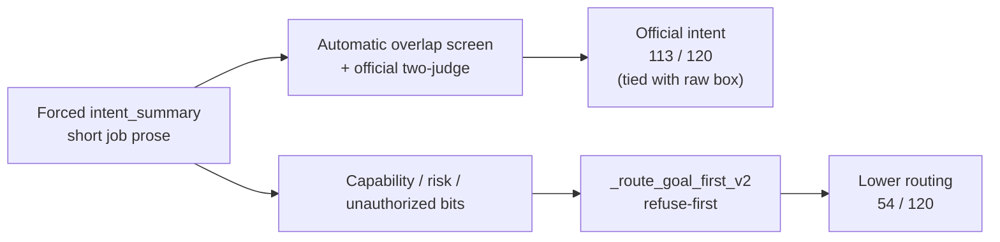
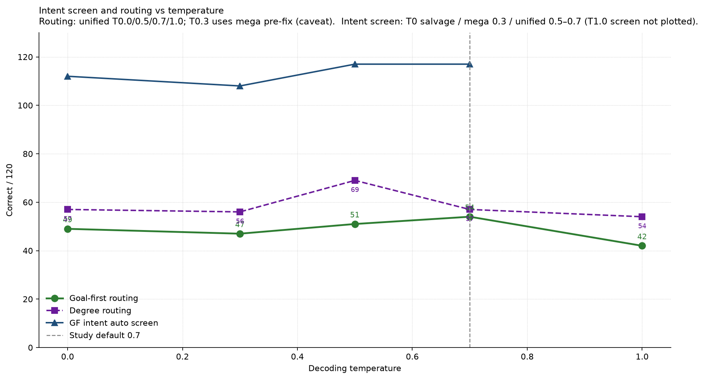

# 5. Results

This chapter answers the research question with evidence and explains the mechanisms. The intellectual centre is **compound ambiguity**: can the system name the intended job when several unknowns co-occur, and — secondarily — does it select the gold handling path once that job is written?

**How to read the numbers.** Three evidence layers are kept distinct throughout:

| Layer | Temperature / pack | Used for |
|---|---|---|
| Official intent (H1) | T0 final-close two-judge | Primary intent verdict vs raw |
| Study default scoreboard | **T0.7** unified fix-stack (job **55670**) | Manager routing and diagnostics |
| Mechanism digs | T0 matched set | The **62**, CA-0007, most figures |

Lower temperatures (**0.0, 0.3, 0.5**) are an ablation against 0.7 (H3). Temperature **1.0** is the hotter probe (H4). Automatic overlap is a screen on `intent_summary` only — never a substitute for two-judge. The old reasoning-field 68 / 60 gauge is not used.

---

## 5.1 The story in one page

| # | Finding |
|---:|---|
| 1 | Under compound load at **T0.7**, manager routing is GF **54**, degree **57**, timid **29**, blind **21** / 120; intent auto screen **117 / 120**; capability **0.442**; risk-sensitive **32 / 53** |
| 2 | Official two-judge is still **only at T0** (**113 = 113** GF vs raw) — H1 Rejected on that protocol; absolute writing strong. Official intent at 0.7 is **[Results Incoming]** |
| 3 | H2 Rejected at T0.7: GF **54** does not beat historically raw **88** (T0) and does not clearly beat degree **57** |
| 4 | Dissociation is the compound-ambiguity failure mode: the router does not check whether the intent box matched gold. On the T0 matched set, **62** automatic-overlap passes still mis-route (46 refuse / 13 ask / 3 execute) |
| 5 | H3 ablation: cooling does not rescue GF routing (unified T0.0 **49**; mega T0.3 **47**; unified T0.5 **51**; default **54**). Degree peaks at 0.5 (**69**) |
| 6 | H4 at **T1.0**: GF routing falls to **42 / 120** (degree **54**, timid **26**, blind **24**) — provisional support that hotter sampling worsens the same refuse-first stack |
| 7 | Wording still **0 / 23** (**[FIXABLE]**); ambiguity exact-set ~**2 / 120** (**[LIMITATION]**; soft F1 ~0.41). Failed-row repair **56191** = **[FIXABLE]** |

*Figure 1. Automatic-overlap screen on `intent_summary` (Jaccard ≥ 0.18) for the **T0 matched set**. This is not two-judge and not the T0.7 scoreboard. At T0.7 the shared GF screen is **117 / 120** (Section 5.3).*

**Discussion.** Figure 1 is a corroborating T0 screen. Once raw and fine-tune emit a short job box, the cheap screen is near ceiling (**120 / 119**) while goal-first is **112**. Official primary remains two-judge at T0 (**113 = 113**). Against compound ambiguity: naming the multi-slot job is largely solved on this exam; the remaining problem is what the stack *does* with that writing.

*Figure 2. Left: official two-judge intent (T0) beside secondary routing. Right: goal-first automatic screen split into the four intent×route cells (T0 matched set).*

**Discussion.** The left panel is the study’s headline dissociation measured where two-judge exists: raw and goal-first both reach **113 / 120** official intent at T0, but routing diverges (**88** vs **54**). At T0.7 the same routing weakness appears for managers (GF **54** vs degree **57**). The right panel shows where goal-first’s automatic passes go on the T0 set: **62** rows name the job under the cheap screen and still take the wrong route. That slab is the mechanism chapter (Section 5.5), not a claim that intent failed.

*Figure 3. Secondary outcome: routing correctness on the **T0 matched set** (degree **59**, timid **26**). Study-default **T0.7** manager counts are GF **54** / degree **57** / timid **29** / blind **21** (Section 5.3). Raw/FT have no matched T0.7 routing emit.*

**Discussion.** Routing is where write-then-route loses. At T0, raw and fine-tune lead; degree edges goal-first; timid and context-blind collapse. At T0.7 the manager order is the same pattern with slightly different counts. Context-blind’s **21 / 120** is refuse-heavy behaviour after the card is withheld — not safer understanding. H2: the risk-aware router does **not** beat historically raw routing or the simpler degree policy.

---

## 5.2 How goal-first reaches strong intent — and why that is not a win over raw

| Step | What happens | Effect on score |
|---|---|---|
| 1 | Prompt forces a dedicated job paragraph | Writing is scored on a clean field |
| 2 | Scene nouns land in that paragraph | Automatic overlap **112 / 120** at T0; **117 / 120** at T0.7 |
| 3 | Two-judge check on the same box | **113 / 120** official intent (**T0 final-close only**) |
| 4 | Raw / fine-tune also emit `intent_summary` (final-close intent-box run) | Automatic **120 / 119**; two-judge **113 / 107** at T0 |
| 5 | Router never asks “did the box match gold?” | Route uses capability / unauthorized / risk bits |
| 6 | Those bits are often wrong (capability **0.425** at T0; **0.442** at T0.7) | Intent stays high; routing collapses (**54 / 120** at both T0 salvage and T0.7) |

**Which intent number to trust?** Official primary = **two-judge** (available at T0 only so far). Automatic overlap is a screen on the **same** `intent_summary` field. Do not revive the old reasoning-field 68 / 60 numbers in comparisons. Do not invent a T0.7 two-judge score.

---

## 5.3 Intent and routing scoreboard

### Study default T0.7 — manager systems (unified fix-stack)

Primary scoreboard at the study default. Source: unified job **55670** pulls (`outputs/cluster_pulls/unified_55670/`; see `EVIDENCE_BRIEF.md` / `report_numbers.json`). Two shared failed IDs (CA-0292, CA-0963) count as incorrect; repair **56191** is **[FIXABLE]**.

| System                       | Automatic overlap on `intent_summary` *(screen)* | **Two-judge intent *(official)*** |                                                     Routing *(secondary)* |
| ---------------------------- | -----------------------------------------------: | --------------------------------: | ------------------------------------------------------------------------: |
| New goal-first               |                                    **117 / 120** |            **[Results Incoming]** |                                                              **54 / 120** |
| New degree                   |                  **117 / 120** (shared analysis) |            **[Results Incoming]** |                                                              **57 / 120** |
| New timid                    |                  **117 / 120** (shared analysis) |            **[Results Incoming]** |                                                              **29 / 120** |
| New context-blind            |                     115 / 120 (blind generation) |            **[Results Incoming]** |                                                              **21 / 120** |
| Raw Qwen / Fine-tune at T0.7 |                                                — |                                 — | **[Results Incoming]** (no matched T0.7 raw/FT routing emit in this pack) |

**Supporting metrics at T0.7 (goal-first).** Capability accuracy **0.442**; risk-sensitive **32 / 53**; wording **0 / 23** (**[FIXABLE]**); ambiguity exact-set **2 / 120** (**[LIMITATION]**; micro-F1 ~**0.411**). CPC is demoted (Section 5.7) and is not required for interpretation.

**H2 reading at default.** Goal-first **54** does not beat historically raw **88** (T0 matched) and does not clearly beat degree **57**; it does beat timid **29** and blind **21**.

### Official two-judge — T0 final-close only (H1 protocol)

Official two-judge remains **T0 final-close only**. Do **not** read this table as “T0.7 two-judge.” Manager routing in the right column uses the local r1 salvage (VERIFY_PASSED) for the matched T0 set.

| System | Automatic overlap on `intent_summary` *(screen)* | **Two-judge intent *(official)*** | Routing *(secondary)* |
|---|---:|---:|---:|
| Raw Qwen | **120 / 120** (intent-box emit) | **113 / 120** (same box) | **88 / 120** |
| Fine-tune | **119 / 120** (intent-box emit) | **107 / 120** (same box) | 87 / 120 |
| New goal-first | 112 / 120 | **113 / 120** | **54 / 120** |
| New degree | 112 / 120 (shared analysis) | 113 / 120 (shared analysis) | 59 / 120 |
| New timid | 112 / 120 (shared analysis) | 113 / 120 (shared analysis) | 26 / 120 |
| New context-blind | — (separate blind generation) | **108 / 120** (blind box) | 21 / 120 |

**H1 reading.** Rejected as superiority over raw: two-judge **tie 113 = 113** at T0. Absolute writing is still strong. Official intent at the study default 0.7 remains **[Results Incoming]**.

### Lower-temperature ablation vs 0.7 (H3) and higher-T probe (H4)

| Temp | Goal-first | Degree | Timid | Blind | Intent auto (shared) | Source / caveat |
|---:|---:|---:|---:|---:|---:|---|
| **0.0** (unified fix-reemit) | **49** | **57** | 24 | 21 | — | Unified **55670** fix stack (just completed); capability **0.367** |
| **0.0** (local r1 salvage) | **54** | **59** | 26 | 21 | 112 | Pre-fix T0 protocol base (historical comparator) |
| **0.3** (mega R1) | **47** | **56** | 25 | 21 | 108 | Mega pre-fix; raw/FT routing 82 / 79; unified fix-reemit **[Results Incoming]** |
| **0.5** | **51** | **69** | 23 | 21 | **117** | Unified **55670** fix stack |
| **0.7** | **54** | **57** | 29 | 21 | **117** | Unified **55670** (**study default**) |
| **1.0** | **42** | **54** | 26 | 24 | — | Unified **55670** complete; row-failure rate ↑ (**[LIMITATION]**); H4 |

**Provisional H3.** Lowering temperature does **not** improve goal-first routing versus 0.7. On the unified fix stack, T0.0 is **49** and T0.5 is **51** against default **54**; mega T0.3 is **47**. Intent screen at unified 0.5/0.7 (**117**) is higher than mega 0.3 (**108**) and salvage 0.0 (**112**), with the caveat that stack mix confounds a pure temperature claim until unified T0.3 lands. Degree peaks at **T0.5 (69 / 120)** then falls to **57** at 0.7. Blind stays near **21**.

**Provisional H4.** Raising temperature to **1.0** degrades goal-first routing to **42 / 120** and drops capability accuracy to **0.367** (from **0.442** at 0.7). Degree also falls (**54**). Blind rises slightly to **24**, still refuse-dominated. Schema/row-failure rate is higher at 1.0 (**[LIMITATION]** of noisier structured decode under the same refuse-first policy). Official two-judge at 1.0 remains **[Results Incoming]**.

**Failed rows (repairable).** T0.5: CA-0070, CA-0211 (`bad_intent_summary`). T0.7: CA-0292 (`bad_intent_summary`), CA-0963 (`uncertainty_out_of_range`). Shared analysis → three systems fail per ID. T1.0 carries a larger failure set (**[LIMITATION]** / partially **[FIXABLE]**). Repair job **56191** queued `afterany:55670` — **[FIXABLE]**.

### Supporting metrics across temperatures

| Metric | T0.0 unified | T0.5 unified | T0.7 unified (default) | T1.0 unified |
|---|---:|---:|---:|---:|
| Capability accuracy (GF) | 0.367 | 0.408 | **0.442** | 0.367 |
| Ambiguity micro-F1 (GF) | 0.426 | **0.420** | 0.411 | 0.394 |
| Ambiguity exact-set (GF) | 0 / 120 | 0 / 120 | **2 / 120** | 0 / 120 |
| Clarification wording / 23 | — | **0 / 23** | **0 / 23** | — |
| Risk-sensitive (GF, 53) | — | 30 / 53 | **32 / 53** | — |
| GF routing / 120 | **49** | **51** | **54** | **42** |

CPC omitted from this temperature table on purpose (demoted; Section 5.7).

### Comparability notes

| Note | Rule |
|---|---|
| Study default | Cite **T0.7** unified first for manager routing and diagnostics |
| Official primary intent | Two-judge column only at **T0 final-close**; non-T0 = **[Results Incoming]** |
| Automatic screen | Same `intent_summary` field; raw 120 / FT 119 / GF 112 at T0; shared GF **117** at T0.5/T0.7 |
| Disjoint two-judge misses | Both systems score 113 / 120 at T0, but on different rows (GF vs raw miss lists differ) |
| Shared-analysis routing | At T0.7: **54 / 57 / 29** from one analysis + three Python routers (+ blind second generation) |
| Mega vs unified mix | Disclose when H3 cites mega T0.3 beside unified 0.5/0.7 |
### Intent × routing heatmap (automatic-overlap screen on goal-first)

*Figure 3b. Automatic-overlap intent versus routing on goal-first (N = 120; **T0 matched set**).*

**Discussion.** The dark cell (**62**) is the dissociation mass measured at T0: the cheap screen says the job was named, yet the route missed gold. The off-diagonal cells with intent-no (**4 + 4**) are small — most routing errors are not “failed to write the job.” Gold-execute rows where the box still looked like the job under automatic overlap: **71 / 76**. The same refuse-first story is the leading account of why T0.7 routing stays at **54 / 120**.

---

## 5.4 Case study: correct intent, incorrect route

**CA-0007.** Command: “Can the selected controlled medicine tray be delivered after a scheduled meal service?”  
Follow-up from the nurse: treat the utterance as a delivery request rather than a capability question.

Gold job (short): deliver the selected controlled medicine tray after the 11:00 meal service.  
Gold route: clarify (two trays are pending and no recipient is named in the command).

| System | Intent (automatic overlap on box) | Route | Mechanism |
|---|---|---|---|
| New goal-first | Yes (0.275); names delivery after 11:00 | Refuse | `known_unsafe_or_prohibited`; pilot `unauthorized`; live risk `low` |
| New degree | Same `intent_summary` | Execute | Degree never refuses |
| New timid | Same `intent_summary` | Clarify | Matches gold |
| Raw Qwen | Yes on `intent_summary` intent box | Execute | Also routing-wrong versus gold clarify |

**Discussion.** The paragraph names the delivery job under compound underspecification (tray identity, schedule, recipient). The refuse-first router never reads that success; it fires on the unauthorized bit. Holding writing fixed and swapping only the Python policy moves the route (refuse → execute → clarify). That is policy error under compound load, not missing intent.

---

## 5.5 The 62: intent yes, routing no

**Definition.** Rows where automatic overlap on goal-first `intent_summary` passes (≥ 0.18, no polarity flip) **and** goal-first routing ≠ gold. Defined on the automatic screen, not on two-judge. **Measured on the T0 matched set** (the deep-dive emit where the full intent×route contingency and rule breakdown were computed).

Under compound ambiguity this slab is the decisive failure anatomy: the system has already produced a usable short statement of the multi-slot job, yet the handling path still misses gold. The same refuse-first mechanism is the leading explanation for weak T0.7 routing (**54 / 120**) and for the further drop at T1.0 (**42 / 120**), even though the exact “62” count is a T0 statistic.

*Figure 4. Live rules among the 62 intent-yes / routing-no rows.*

**Discussion.** The mass is refuse-first: `known_incapable` and `known_unsafe_or_prohibited`. Significance: after the job is named, the stack still trusts capability / unauthorized fields that are frequently wrong. This figure is the visual form of H2’s failure mode, not a wording or intent-box failure. Status of the underlying bits: **future science** (router recalibration), not a small emit patch.

*Figure 5. Refuse vs ask vs wrong execute inside the 62.*

**Discussion.** Do not call this slab “62 over-asks.” **46** are refuses, **13** asks, **3** wrong executes. The ask slice is real but secondary; the refuse slice is the dominant story and matches the gold-execute → refuse mass in the confusion heatmaps (Figure 11).

### What happened

| Stage | Count / fact | Meaning |
|---|---:|---|
| Intent-yes / routing-no | **62** | Dissociation slab |
| Refuse | **46** | Main failure mode |
| Ask (`default_clarify`) | **13** | Still wrong versus gold |
| Wrong execute (`context_licensed_execute`) | **3** | CA-0225, CA-0512, CA-0798 |
| Of refuses: `known_incapable` | **36** | Gold capable **34**, conditional **2**, incapable **0** |
| Of refuses: `known_unsafe_or_prohibited` | **10** | Live risk **low**, gold **capable**, pilot `unauthorized` |

**Mechanistic chain.**

1. Forced `intent_summary` often matches gold under Jaccard and under two-judge.
2. `_route_goal_first_v2` ignores that match and reads capability / pilot / risk / speech-act bits.
3. Thirty-six intent-correct rows stamp `incapable` while gold is capable or conditional → refuse. Justified incapable in that slice: **0**.
4. Ten more stamp `unauthorized` at live low risk → refuse; timid asks all ten.
5. Residuals: `default_clarify` (13) or wrong execute (3).

### Policy ablation with analysis held fixed

Counts below are from the **T0 matched set** (mechanism ablation). At study default **T0.7** the same policy order is GF **54** / degree **57** / timid **29** / blind **21**.

| System | Policy | Routing (T0 matched) |
|---|---|---:|
| Goal-first | Refuse-first on incapable / unauthorized / high-risk unsafe | **54 / 120** |
| Degree | Uncertainty thresholds; cannot refuse | **59 / 120** |
| Timid | Ask unless clean execute license fires | **26 / 120** |
| Context-blind | Same refuse-first rules on a blind second generation | **21 / 120** |

| Extra fact | Number |
|---|---:|
| Degree gold-refuse recall | **0 / 21** |
| Timid false asks | 55 |
| Context-blind capable recall | **0** |
| Context-blind refuses of gold-execute | 75 / 76 |

*Figure 6. Capability-bit accuracy on the T0 matched set: goal-first **0.425** versus raw ≈ **0.667**. At T0.7 unified, GF capability rises to **0.442** but routing stays at **54 / 120**.*

**Discussion.** The router consumes this bit. Lower capability accuracy is not cosmetic — it is the direct input to the refuses that dominate the 62. Recalibrating capability with a dedicated LLM classifier/judge (Conclusion §6.3) is the next experiment, not more CPC work.

*Figure 7. Wrong “cannot” / “unauthorized” bits pushing refuses after a usable intent box.*

**Discussion.** Read with Figure 4: when the bit is wrong, refuse-first converts a good intent paragraph into a wrong handling path. CA-0007 is the case form of this panel.

---

## 5.6 Clarification: asking versus asking well

*Figure 8. Ask-label precision–recall (did the system press Ask?).*

**Discussion.** Raw / fine-tune lead on ask-label F1. Goal-first family under-asks or asks for the wrong reason relative to gold. Ask-label is separate from wording quality: a system can press Ask and still emit an unusable question string.

| System | Ask-label F1 | Wording correct / 23 |
|---|---:|---:|
| Raw Qwen | **0.557** | 0 / 23 |
| Fine-tune | 0.540 | 0 / 23 |
| New goal-first | 0.286 | 0 / 23 |
| New degree | 0.253 | 0 / 23 |
| New timid | 0.286 | 0 / 23 |
| New context-blind | 0.000 | 0 / 23 |

### Clarification wording of 0 / 23 — **[FIXABLE]**

Wording is scored on the 23 gold-ask rows. On unified T0.5/T0.7 emits it remains **0 / 23**.

| What happened on 23 gold-ask rows (T0 autopsy) | Count | Wording credit |
|---|---:|---|
| Refused | 14 | 0 |
| Executed instead of asking | 3 | 0 |
| Asked (slot-name templates) | 6 | **still 0** |

Empty `candidate_interpretations` forced slot-name templates. Official score stays **0 / 23** until real clarification candidates are emitted — a packaging failure, not evidence that the compound job was unnamed.

---

## 5.7 Risk, low-stakes routing, and why CPC is demoted

### What carries the interpretation

The scientific story of this report does **not** depend on CPC. Compound-job naming (intent) and handling-path selection (routing), plus the capability-driven refuse mechanism in the **62**, are enough to interpret H1–H4.

| Metric | Role in this report |
|---|---|
| Intent (two-judge / auto screen) | **Primary** |
| Routing | **Secondary**, but central to H2/H3/H4 |
| Capability / unauthorized bits | **Mechanism** for false refuses |
| Risk-sensitive / low-risk routing | Diagnostic of stakes |
| Ambiguity exact-set / wording | Diagnostic; currently weak |
| **CPC slot-binding F1** | **Demoted** — proposal sidecar; not required for the dissociation claim |

CPC is retained only as an honest secondary autopsy: historically **0.045** at T0; ~**0.113** at T0.7 after coerce. It does not change the conclusion that naming succeeds while refuse-first policy fails. Future work may drop CPC from the headline evaluation plan entirely.

### Risk and low-stakes (still relevant)

Gold risk labels: **64** low, **34** medium, **19** high, **3** unknown. Risk-sensitive accuracy uses the **53 medium+high** rows. At T0.7, goal-first risk-sensitive accuracy is **32 / 53**. On the **64 low** rows (T0 matched):

| System | Low-risk routing correct | Rate |
|---|---:|---:|
| Raw Qwen | **46 / 64** | 0.719 |
| Fine-tune | **45 / 64** | 0.703 |
| New degree | **35 / 64** | 0.547 |
| New goal-first | **27 / 64** | 0.422 |
| New timid | **11 / 64** | 0.172 |
| New context-blind | **0 / 64** | 0.000 |

**Discussion.** Goal-first is weak even on low-stakes rows. Several `unauthorized` refuses inside the 62 are live **low** risk (including CA-0007). That is policy miscalibration, not a CPC failure.

| Risk / reject (T0 matched) | Raw | Goal-first | Degree | Context-blind |
|---|---:|---:|---:|---:|
| Risk-sensitive decision accuracy (53) | **0.736** | 0.491 | 0.434 | 0.377 |
| Gold-refuse recall | **21 / 21** | 17 / 21 | **0 / 21** | 21 / 21* |

\*Context-blind also refuses almost all gold-execute rows.

---

## 5.8 Ambiguity tags (diagnostic, not primary)

Ambiguity-type bags are a supporting diagnosis of whether the model recognises *which* underspecifications are present. Exact-set match is a harsh criterion; soft F1 is more informative about partial credit.

| Metric | New goal-first (T0 frozen) | Raw Qwen (T0) | Goal-first at T0.7 unified |
|---|---:|---:|---:|
| Ambiguity exact-set | **0 / 120** | 0 / 120 | **~2 / 120** |
| Ambiguity micro-F1 | ~0.215 | — | **~0.411** |
| Capability accuracy | 0.425 | ≈0.667 | **0.442** |

*Figure 9. Ambiguity tagging errors on the frozen T0 emit (exact-set 0 / 120).*

**Discussion.** Soft overlap already exists on many rows on the frozen emit, so the system is not emitting empty bags. Exact-set fails because bags binge `action_order` and miss gold-heavy classes. At T0.7, soft micro-F1 rises to ~**0.41** while exact-set stays near floor — treat exact-set as a **[LIMITATION]**. A constrained-prompt vocab omission on early R1 rows was a separate **[FIXABLE]** packaging bug; the fix is in the unified stack. Residual exact-set difficulty remains even after that fix.

---

## 5.9 Stability and confusion

*Figure 10. Replica agreement for routing on the completed temperature-0 set.*

**Discussion.** Stability asks whether the routing story is a one-off draw. High replica agreement on the completed temperature-0 set supports treating refuse-first routing weakness as a reproducible property of the stack, not noise. The study-default **54 / 120** at T0.7 is a separate emit, but the same mechanism accounts for it.

*Figure 11. Confusion matrices; goal-first gold-execute → refuse is the visual form of the 62.*

**Discussion.** The off-diagonal mass from gold execute into refuse is the same mechanism as Figures 4–7. It is the strongest single picture of why H2 fails while intent writing stays high.

*Figure 12. Per-route accuracy / F1 support by system.*

**Discussion.** Aggregate routing hides class imbalance. This panel shows which handling paths each system can actually hit. Degree’s zero gold-refuse recall and timid’s ask inflation appear here as class-level pathology, not just a lower total.

*Figure 13. Intent automatic-overlap screen and routing versus decoding temperature (real data; not a placeholder). Goal-first routing is flat under cooling then drops at **1.0** (**42**). Degree peaks at **0.5** (**69**). Intent screen stays high where plotted. T0.3 routing uses mega pre-fix (caveat); unified T0.3 still **[Results Incoming]** (~16/120 mid-emit).*

**Discussion.** Visual form of H3/H4. Hotter sampling does not invent a better policy — it feeds the same refuse-first rules with noisier bits. The gap between the intent screen (~110+) and GF routing (~40–55) is the dissociation, drawn across temperature.

---

## 5.10 Evidence status (what is settled vs open)

Plain inventory: [[10-cluster-results-status]].

| Claim | Status |
|---|---|
| Manager routing + auto intent + capability + risk at **T0.7** | **Settled** (2 shared failed IDs **[FIXABLE]** via **56191**) |
| Official two-judge intent (H1) | **Settled at T0 only**; at 0.7/1.0 **[Results Incoming]** |
| H3 cooling ablation | **Provisional** (unified T0.3 still emitting ~16/120) |
| H4 hotter sampling | **Provisional on routing** (GF **42**) |
| Wording 0 / 23 | **[FIXABLE]** |
| Ambiguity exact-set near floor | **[LIMITATION]** |
| CPC | **Demoted** — not required for interpretation |
| Mechanism digs (62, CA-0007) | **Settled** on T0 matched set |

**Still running on cluster right now:** job **55670** fix-reemit **T0.3**; then job **56191** repairs failed rows. That is the entire remaining GPU queue for this pack.

---

## 5.11 Relation to the research question

The results answer the research question as follows.

**H1 — Rejected** as superiority over raw on the only official protocol available (T0 two-judge **113 = 113**). Absolute writing remains strong (T0.7 auto screen **117 / 120**); official intent at **0.7** is still **[Results Incoming]**.

**H2 — Rejected** at study default: T0.7 GF routing **54** does not beat historically raw **88**, and does not clearly beat degree **57**. The T0 **62**-row slab shows why: naming succeeds, refuse-first policy fails.

**H3 — Provisional: not supported.** Cooling does not rescue GF routing (unified T0.0 **49** vs default **54**).

**H4 — Provisional: supported** on routing. T1.0 GF **42** vs 0.7 **54**, with noisier decode failures (**[LIMITATION]**).

Secondary wording/ambiguity weakness does **not** overturn the intent result. CPC is demoted and is not part of the dissociation claim.

The next scientific step is not more CPC work. It is to stop false refuses at the capability gate, then re-observe how the manager behaves under compound ambiguity — with a stronger ambiguity adjudication stack if tagging remains near floor.

---

## 5.12 Sufficiency of Pilot-120 for the observed pattern

| Pattern | Evidence |
|---|---|
| Intent–policy dissociation | Official intent 113 vs routing 54 (T0); auto screen 117 vs routing 54 (T0.7); 62-row slab |
| Policy-only ablation | Shared analysis: T0 **54 / 59 / 26**; T0.7 **54 / 57 / 29** |
| Unjustified incapable refuses | 34 of 36 such refuses in the 62 are gold-capable |
| Low-stakes weakness | Goal-first 27 / 64 low-risk routing; unauthorized refuses at live low risk |
| Context dependence | Context-blind capable recall 0; low-risk routing 0 / 64 |

N = 120 is sufficient to establish these regularities on this exam. Larger sets can test generality later.
