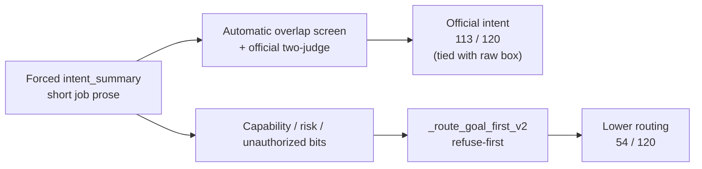

# 5. Results

This chapter answers the research question with evidence and explains the mechanisms. Unless marked **[Results Incoming]**, system-comparison counts are from the completed temperature-0 matched set (live v2 R1 for managers; final-close intent-box emit for raw / fine-tune writing). The study default temperature is **0.7**; those centred tables are still arriving. Every table keeps the locked system order.

**Field rule for this chapter.** Automatic overlap and two-judge intent are reported only on dedicated job boxes (`intent_summary`). An older lexical screen on free-form reasoning (68 / 60) was a temporary gauge before those boxes existed; it is **not** used in the scoreboard or figures below.

---

## 5.1 The story in one page

| # | Finding |
|---:|---|
| 1 | With intent boxes on every comparator, official two-judge intent is **tied** at **113 / 120** (goal-first vs raw); automatic overlap actually favours raw (**120 / 120** vs **112 / 120**) |
| 2 | Goal-first routing is weaker than raw (**54 / 120** vs **88 / 120**) |
| 3 | Dissociation remains: the router does not check whether the intent box matched gold |
| 4 | On 62 automatic-overlap passes, routing still fails (46 refuse / 13 ask / 3 execute) |
| 5 | Wording **0 / 23**, CPC F1 **0.045**, and ambiguity tagging are **[FIXABLE]** on follow-on emit **54774** (not mega 54259) |
| 6 | Temperature-0.7 scoreboard and H3/H4 | **[Results Incoming]** |

*Figure 1. Automatic-overlap screen on the same field for every system: `intent_summary` (Jaccard ≥ 0.18).*

**Discussion.** Figure 1 is a corroborating screen, not the official primary. Once raw and fine-tune also emit a short job box, the cheap screen is near ceiling (**120 / 120** and **119 / 120**). Goal-first is **112 / 120** on the same exam. The earlier chart that put raw at 68 by scoring long reasoning was misleading: that was a temporary gauge before the intent-box bug was fixed, not a weaker understanding of the job. Official primary remains two-judge (next figure and Section 5.3).

*Figure 2. Left: official two-judge intent beside secondary routing. Right: goal-first automatic screen split into the four intent×route cells.*

**Discussion.** The left panel is the study’s headline dissociation: raw and goal-first both reach **113 / 120** official intent, but routing diverges (**88** vs **54**). Fine-tune sits close to raw on both axes. The right panel shows where goal-first’s automatic passes go: **62** rows name the job under the cheap screen and still take the wrong route. That slab is the mechanism chapter (Section 5.5), not a claim that intent failed.

*Figure 3. Secondary outcome: routing correctness across the six live systems.*

**Discussion.** Routing is where write-then-route currently loses. Raw and fine-tune lead; degree (never refuse) edges goal-first; timid and context-blind collapse. Context-blind’s **21 / 120** is not “safer understanding” — it is refuse-heavy behaviour after the capability card is withheld (capable recall **0**). Significance for H2: the risk-aware router does **not** beat raw or the simpler policies on this completed set.

---

## 5.2 How goal-first reaches strong intent — and why that is not a win over raw

| Step | What happens | Effect on score |
|---|---|---|
| 1 | Prompt forces a dedicated job paragraph | Writing is scored on a clean field |
| 2 | Scene nouns land in that paragraph | Automatic overlap **112 / 120** on `intent_summary` |
| 3 | Two-judge check on the same box | **113 / 120** official intent |
| 4 | Raw / fine-tune also emit `intent_summary` (final-close intent-box run) | Automatic **120 / 119**; two-judge **113 / 107** |
| 5 | Router never asks “did the box match gold?” | Route uses capability / unauthorized / risk bits |
| 6 | Those bits are often wrong (capability accuracy **0.425**) | Intent stays high; routing collapses |

**Which intent number to trust?** Official primary = **two-judge**. Automatic overlap is a screen on the **same** `intent_summary` field for every system in the scoreboard. Do not revive the old reasoning-field 68 / 60 numbers in comparisons.

---

## 5.3 Intent and routing scoreboard

Completed temperature-0 head-to-head. Temperature **0.7** tables: **[Results Incoming]**.

| System | Automatic overlap on `intent_summary` *(screen)* | **Two-judge intent *(official)*** | Routing *(secondary)* |
|---|---:|---:|---:|
| Raw Qwen | **120 / 120** (intent-box emit) | **113 / 120** (same box) | **88 / 120** |
| Fine-tune | **119 / 120** (intent-box emit) | **107 / 120** (same box) | 87 / 120 |
| New goal-first | 112 / 120 | **113 / 120** | **54 / 120** |
| New degree | 112 / 120 (shared analysis) | 113 / 120 (shared analysis) | 59 / 120 |
| New timid | 112 / 120 (shared analysis) | 113 / 120 (shared analysis) | 26 / 120 |
| New context-blind | — (separate blind generation) | **108 / 120** (blind box) | 21 / 120 |

### Comparability notes (from the records)

| Note | What the records show |
|---|---|
| Official primary intent | Two-judge column only. |
| Same-field automatic screen | Raw 120 / fine-tune 119 / goal-first 112 — all on `intent_summary`. Raw’s cheap screen is stronger; the official judge is the claim that matters. |
| Historical 68 / 60 | Reasoning-field gauge before intent boxes existed. **Dropped from the scoreboard.** |
| Two counts of 113 | Same AND-judge protocol on different texts; miss lists are **disjoint**. Goal-first misses: CA-0149, CA-0245, CA-0470, CA-0552, CA-0714, CA-0846, CA-0923. Raw misses: CA-0058, CA-0225, CA-0226, CA-0262, CA-0426, CA-0762, CA-0878. |
| Routing 54 / 59 / 26 | Shared cached analysis for three Python routers. Context-blind 21 uses a second generation. |

### Intent × routing heatmap (automatic-overlap screen on goal-first)

*Figure 3b. Automatic-overlap intent versus routing on goal-first (N = 120).*

**Discussion.** The dark cell (**62**) is the dissociation mass: the cheap screen says the job was named, yet the route missed gold. The off-diagonal cells with intent-no (**4 + 4**) are small — most routing errors are not “failed to write the job.” Gold-execute rows where the box still looked like the job under automatic overlap: **71 / 76**.

---

## 5.4 Case study: correct intent, incorrect route

**CA-0007.** Command: “Can the selected controlled medicine tray be delivered after a scheduled meal service?”  
Follow-up from the nurse: treat the utterance as a delivery request rather than a capability question.

Gold job (short): deliver the selected controlled medicine tray after the 11:00 meal service.  
Gold route: clarify (two trays are pending and no recipient is named in the command).

| System | Intent (automatic overlap on box) | Route | Mechanism |
|---|---|---|---|
| New goal-first | Yes (0.275); names delivery after 11:00 | Refuse | `known_unsafe_or_prohibited`; pilot `unauthorized`; live risk `low` |
| New degree | Same `intent_summary` | Execute | Degree never refuses |
| New timid | Same `intent_summary` | Clarify | Matches gold |
| Raw Qwen | Yes on `intent_summary` intent box | Execute | Also routing-wrong versus gold clarify |

**Discussion.** The paragraph names the delivery job. The refuse-first router never reads that success; it fires on the unauthorized bit. Holding writing fixed and swapping only the Python policy moves the route (refuse → execute → clarify). That is policy error, not missing intent.

---

## 5.5 The 62: intent yes, routing no

**Definition.** Rows where automatic overlap on goal-first `intent_summary` passes (≥ 0.18, no polarity flip) **and** goal-first routing ≠ gold. Defined on the automatic screen, not on two-judge.

*Figure 4. Live rules among the 62 intent-yes / routing-no rows.*

**Discussion.** The mass is refuse-first: `known_incapable` and `known_unsafe_or_prohibited`. Significance: after the job is named, the stack still trusts capability / unauthorized fields that are frequently wrong. This figure is the visual form of H2’s failure mode, not a wording or intent-box failure. Status of the underlying bits: **future science** (router recalibration), not a small emit patch.

*Figure 5. Refuse vs ask vs wrong execute inside the 62.*

**Discussion.** Do not call this slab “62 over-asks.” **46** are refuses, **13** asks, **3** wrong executes. The ask slice is real but secondary; the refuse slice is the dominant story and matches the gold-execute → refuse mass in the confusion heatmaps (Figure 11).

### What happened

| Stage | Count / fact | Meaning |
|---|---:|---|
| Intent-yes / routing-no | **62** | Dissociation slab |
| Refuse | **46** | Main failure mode |
| Ask (`default_clarify`) | **13** | Still wrong versus gold |
| Wrong execute (`context_licensed_execute`) | **3** | CA-0225, CA-0512, CA-0798 |
| Of refuses: `known_incapable` | **36** | Gold capable **34**, conditional **2**, incapable **0** |
| Of refuses: `known_unsafe_or_prohibited` | **10** | Live risk **low**, gold **capable**, pilot `unauthorized` |

**Mechanistic chain.**

1. Forced `intent_summary` often matches gold under Jaccard and under two-judge.
2. `_route_goal_first_v2` ignores that match and reads capability / pilot / risk / speech-act bits.
3. Thirty-six intent-correct rows stamp `incapable` while gold is capable or conditional → refuse. Justified incapable in that slice: **0**.
4. Ten more stamp `unauthorized` at live low risk → refuse; timid asks all ten.
5. Residuals: `default_clarify` (13) or wrong execute (3).

### Policy ablation with analysis held fixed

| System | Policy | Routing |
|---|---|---:|
| Goal-first | Refuse-first on incapable / unauthorized / high-risk unsafe | **54 / 120** |
| Degree | Uncertainty thresholds; cannot refuse | **59 / 120** |
| Timid | Ask unless clean execute license fires | **26 / 120** |
| Context-blind | Same refuse-first rules on a blind second generation | **21 / 120** |

| Extra fact | Number |
|---|---:|
| Degree gold-refuse recall | **0 / 21** |
| Timid false asks | 55 |
| Context-blind capable recall | **0** |
| Context-blind refuses of gold-execute | 75 / 76 |

*Figure 6. Capability-bit accuracy: goal-first **0.425** versus raw ≈ **0.667**.*

**Discussion.** The router consumes this bit. Lower capability accuracy is not a cosmetic secondary metric — it is the direct input to the refuses that dominate the 62. Status: calibration / modelling **limitation of the current stack**, addressed by future router work rather than wording/CPC emit alone.

*Figure 7. Wrong “cannot” / “unauthorized” bits pushing refuses after a usable intent box.*

**Discussion.** Read with Figure 4: when the bit is wrong, refuse-first converts a good intent paragraph into a wrong handling path. CA-0007 is the case form of this panel.

---

## 5.6 Clarification: asking versus asking well

*Figure 8. Ask-label precision–recall (did the system press Ask?).*

**Discussion.** Raw / fine-tune lead on ask-label F1. Goal-first family under-asks or asks for the wrong reason relative to gold. Ask-label is separate from wording quality: a system can press Ask and still emit an unusable question string.

| System | Ask-label F1 | Wording correct / 23 |
|---|---:|---:|
| Raw Qwen | **0.557** | 0 / 23 |
| Fine-tune | 0.540 | 0 / 23 |
| New goal-first | 0.286 | 0 / 23 |
| New degree | 0.253 | 0 / 23 |
| New timid | 0.286 | 0 / 23 |
| New context-blind | 0.000 | 0 / 23 |

### Clarification wording of 0 / 23 — **[FIXABLE]**

Already scored on CPU. **Not** on mega 54259. Fix-emit **54774** carries generator **1.1.0**.

| What happened on 23 gold-ask rows | Count | Wording credit |
|---|---:|---|
| Refused | 14 | 0 |
| Executed instead of asking | 3 | 0 |
| Asked (slot-name templates) | 6 | **still 0** |

Empty `candidate_interpretations` on all 120 rows forced slot-name templates. Official score stays **0 / 23** until new questions are emitted.

---

## 5.7 Slot binding (CPC) and risk — including low-stakes rows

| System | CPC F1 *(micro-F1)* | Risk-sensitive decision **accuracy** (53 medium+high) |
|---|---:|---:|
| Raw Qwen | — (no filled CPC cells) | **0.736** (39 / 53) |
| Fine-tune | — | 0.755 (40 / 53) |
| New goal-first | **0.045** | 0.491 (26 / 53) |
| New degree | 0.045 | 0.434 (23 / 53) |
| New timid | 0.045 | 0.245 (13 / 53) |
| New context-blind | — | 0.377 (20 / 53) |

### Why medium+high is a separate exam — and what happens on low

Gold risk labels: **64** low, **34** medium, **19** high, **3** unknown, **0** none. The risk-sensitive accuracy uses only the **53 medium+high** rows so the headline risk number emphasises higher-stakes mistakes. That design choice is deliberate, but it is **not** a claim that low-stakes rows do not matter.

Low-risk rows remain inside ordinary routing. On the **64 low** rows alone:

| System | Low-risk routing correct | Rate |
|---|---:|---:|
| Raw Qwen | **46 / 64** | 0.719 |
| Fine-tune | **45 / 64** | 0.703 |
| New degree | **35 / 64** | 0.547 |
| New goal-first | **27 / 64** | 0.422 |
| New timid | **11 / 64** | 0.172 |
| New context-blind | **0 / 64** | 0.000 |

**Discussion.** Goal-first is already weak on low-stakes routing (**27 / 64**), not only on the 53-row risk exam. Several of the ten `unauthorized` refuses inside the 62 are live **low** risk (including CA-0007): the stack treats low-stakes capable jobs as prohibited. Context-blind’s **0 / 64** shows that withholding the card destroys low-stakes execute decisions entirely. So excluding low from the *restricted* risk accuracy is a focus choice; the low-stakes behaviour is still analysed here and still counts against H2.

### CPC F1 of 0.045 — **[FIXABLE]**

| Quantity | Count |
|---|---:|
| Gold filled cells | 678 |
| Pred cells with `status == filled` | 78 (only 6 / 120 rows) |
| True / false / false-neg | 17 / 61 / 661 |
| Official micro-F1 | **0.045** |

Usable values stamped `unknown` / `not_applicable` are ignored by the official scorer. Fix-emit **54774** includes prompt + parse coerce (`unknown` + non-empty value → `filled`).

| Risk / reject | Raw | Goal-first | Degree | Context-blind |
|---|---:|---:|---:|---:|
| Risk-sensitive decision accuracy (53) | **0.736** | 0.491 | 0.434 | 0.377 |
| Gold-refuse recall | **21 / 21** | 17 / 21 | **0 / 21** | 21 / 21* |

\*Context-blind also refuses almost all gold-execute rows.

---

## 5.8 Ambiguity tags and speech acts

| Metric | New goal-first | Raw Qwen |
|---|---:|---|
| Ambiguity exact-set | **0 / 120** | 0 / 120 |
| Ambiguity macro-F1 | 0.246 | 0.077 |
| Capability accuracy | 0.425 | 0.667 |

*Figure 9. Ambiguity tagging errors on the frozen emit (exact-set 0 / 120).*

**Discussion.** Soft overlap already exists on **62 / 120** rows (micro-F1 ≈ 0.215), so the system is not emitting empty bags. Exact-set fails because bags binge `action_order` and miss gold-heavy classes. Two layers: (1) tagging quality; (2) constrained-prompt vocab omission on **111 / 120** R1 rows — now fixed in code on job **54774**. Status: **[FIXABLE]** for the prompt bug; residual exact-set difficulty may remain a soft **limitation** even after re-emit (old manager ceiling ≈ 8 / 120).

---

## 5.9 Stability and confusion

*Figure 10. Replica agreement for routing on the completed temperature-0 set.*

**Discussion.** Stability asks whether the routing story is a one-off draw. High replica agreement supports treating the 54 / 120 routing result as a reproducible property of the stack at temperature 0, not noise.

*Figure 11. Confusion matrices; goal-first gold-execute → refuse is the visual form of the 62.*

**Discussion.** The off-diagonal mass from gold execute into refuse is the same mechanism as Figures 4–7. It is the strongest single picture of why H2 fails while intent writing stays high.

*Figure 12. Per-route accuracy / F1 support by system.*

**Discussion.** Aggregate routing hides class imbalance. This panel shows which handling paths each system can actually hit. Degree’s zero gold-refuse recall and timid’s ask inflation appear here as class-level pathology, not just a lower total.

---

## 5.10 What is finished versus incoming

| Item | Status |
|---|---|
| Two-judge intent, routing, risk-sensitive accuracy, ask-label, low-risk routing slice (temperature-0) | Done |
| Intent scoreboard field alignment (intent boxes only; drop reasoning 68 / 60) | Done in this chapter |
| Wording 0 / 23, CPC F1 0.045, ambiguity prompt repair | **[FIXABLE]** on fix-emit **54774** behind mega 54259 |
| Full tables at default temperature **0.7**; H3 / H4 | **[Results Incoming]** |

---

## 5.11 Relation to the research question

| Supported | Rejected / pending |
|---|---|
| Write-then-route produces strong official intent writing (**113 / 120**) | H1 as stated (“more often than raw”): **not supported** — tied at 113 / 113; automatic screen favours raw 120 vs 112 |
| Shared-analysis routers move routing (**54 / 59 / 26**) without rewriting the intent box | H2: goal-first beats raw on routing or risk-sensitive accuracy |
| Miscalibrated capability / unauthorized fields explain most of the 62 | Wording / CPC zeros imply intent failure |
| Low-stakes routing is also weak for goal-first (**27 / 64**) | Withholding context improves safety |
| | H3 / H4 **[Results Incoming]** |

**H1.** **Not confirmed as an improvement over raw** once both systems use intent boxes: two-judge **113 = 113**; automatic overlap **112 < 120**.  
**H2.** **Rejected**: routing 54 vs 88; risk-sensitive 0.491 vs 0.736; low-risk routing 27 / 64 vs 46 / 64.  
**H3 / H4.** **[Results Incoming].**

Router recalibration remains future work so that strong intent writing is not discarded by refuse-first policy.

---

## 5.12 Sufficiency of Pilot-120 for the observed pattern

| Pattern | Evidence |
|---|---|
| Intent–policy dissociation | Official intent 113 versus routing 54; 62-row slab |
| Policy-only ablation | Shared analysis yields 54 / 59 / 26 |
| Unjustified incapable refuses | 34 of 36 such refuses are gold-capable |
| Low-stakes weakness | Goal-first 27 / 64 low-risk routing; several unauthorized refuses at live low risk |
| Context dependence | Context-blind capable recall 0; low-risk routing 0 / 64 |

N = 120 is sufficient to establish these regularities. Larger sets can test generality later.
