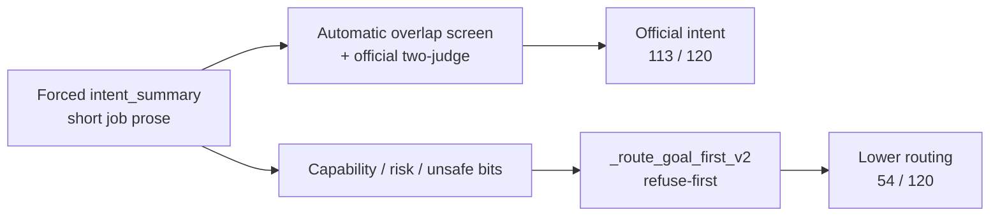

# 5. Results

This chapter answers the research question with evidence and explains the mechanisms. Unless marked **[Results Incoming]**, system-comparison counts are from the completed temperature-0 matched set. The study default temperature is **0.7**; those centred tables are still arriving. Every table keeps the locked system order.

---

## 5.1 The story in one page

| # | Finding |
|---:|---|
| 1 | Goal-first improves **official** intent writing (two-judge **113 / 120**) |
| 2 | Goal-first routing is weaker than raw Qwen (secondary) |
| 3 | Dissociation: forced intent summary versus refuse-first routing on miscalibrated fields |
| 4 | Wording and CPC failures are **[FIXABLE]** on frozen predictions (not the GPU sweep) |
| 5 | Temperature-0.7 scoreboard | **[Results Incoming]** |

*Figure 1. Intent writing exams. Automatic overlap on raw/fine-tune used written reasoning; goal-first uses `intent_summary`. Official intent for systems with an intent box is the two-judge protocol (Section 5.3).*

*Figure 2. Official/primary intent beside secondary routing. The highlighted region marks 62 rows with correct intent and incorrect routing.*

*Figure 3. Secondary outcome: routing correctness. Context-blind routing of 21 / 120 coincides with gold refuse support under a refuse-heavy policy.*

---

## 5.2 How goal-first reaches strong intent

| Step | What happens | Effect on score |
|---|---|---|
| 1 | Prompt forces a dedicated job paragraph first | Writing is scored on a clean field |
| 2 | Scene nouns land in that paragraph | Automatic overlap ≥ 0.18 often passes |
| 3 | Two-judge check on the same box | **113 / 120** — official primary intent |
| 4 | Router never asks “did the box match gold?” | Route uses capability / unauthorized / risk bits |
| 5 | Those bits are often wrong (capability accuracy ≈ 0.425) | Intent stays high; routing collapses |

**Which intent number to trust?** Use **two-judge 113 / 120** as the official primary result for goal-first. Automatic overlap **112 / 120** is a corroborating screen on the same box. Raw Qwen’s automatic overlap **68 / 120** was scored on long reasoning before a dedicated intent box existed; once raw also has a short intent box, two-judge intent is **113 / 120**. The fixed field (intent box) is what makes the official protocol comparable.

---

## 5.3 Intent and routing scoreboard

Completed temperature-0 matched set (interim head-to-head). Temperature **0.7** tables: **[Results Incoming]**.

| System | Automatic overlap *(screen)* | **Two-judge intent *(official)*** | Routing *(secondary)* |
|---|---:|---:|---:|
| Raw Qwen | 68 / 120 (T39 *reasoning*) | **113 / 120** (*new intent box*) | **88 / 120** |
| Fine-tune | 60 / 120 (T39 reasoning) | **107 / 120** (new intent box) | 87 / 120 |
| New goal-first | 112 / 120 (`intent_summary`) | **113 / 120** (same box) | **54 / 120** |
| New degree | (same 112 box) | (same writing) | 59 / 120 |
| New timid | (same 112 box) | (same writing) | 26 / 120 |
| New context-blind | — | **108 / 120** (blind box) | 21 / 120 |

| Comparability note | Explanation |
|---|---|
| Official primary intent | Two-judge column |
| 112 versus 68 | Different fields; do not subtract |
| Two counts of 113 | Same total, different missed rows |
| Routing 54 / 59 / 26 | Identical writing; different Python policies |

Intent × routing under the automatic overlap screen on goal-first writing:

| | Routing correct | Routing wrong |
|---|---:|---:|
| Intent yes | 50 | **62** |
| Intent no | 4 | 4 |

Gold-execute rows where the box still looked like the job: **71 / 76**.

---

## 5.4 Case study: correct intent, incorrect route

**CA-0007.** Command: “Can the selected controlled medicine tray be delivered after a scheduled meal service?”  
Follow-up from the nurse: treat the utterance as a delivery request rather than a capability question.

Gold job (short): deliver the selected controlled medicine tray after the 11:00 meal service.  
Gold route: clarify (two trays are pending and no recipient is named in the command).

| System | Intent | Route |
|---|---|---|
| New goal-first | Yes (overlap 0.275); names delivery after 11:00 | Refuse (unsafe / unauthorized) |
| New timid (same writing) | Yes | Ask (matches gold) |
| Raw Qwen | Yes on reasoning (0.237) | Execute |

Identical intent writing with different routers yields different routes.

---

## 5.5 The 62: intent yes, routing no

*Figure 4. Why goal-first missed the route after naming the job. Dominated by `known_incapable` and `known_unsafe_or_prohibited`.*

*Figure 5. Breakdown of intent-yes / routing-no behaviour (refuse vs ask vs wrong execute).*

| Piece of the 62 | Count | Meaning |
|---|---:|---|
| Total intent-yes / routing-no | **62** | Not “62 over-asks” and not “62 refuses” |
| Refuse | 46 | Main failure mode |
| Ask | 13 | Still wrong versus gold |
| Wrong execute | 3 | Too aggressive |
| Of refuses: `known_incapable` | 36 | Gold capable **34**; conditional 2; incapable **0** |
| Of refuses: unsafe / unauthorized | 10 | Gold capable, live low risk |

When a usable intent summary co-occurs with an incorrect capability or safety field, the router acts on the field.

| Same writing, different Python | Routing |
|---|---:|
| Goal-first | 54 / 120 |
| Degree (never refuse) | 59 / 120 |
| Timid (ask unless clean) | 26 / 120 |
| Context-blind | 21 / 120 |

| Extra fact | Number |
|---|---|
| Degree gold-refuse recall | **0 / 21** |
| Timid false asks | 55 |
| Context-blind capable recall | **0** |
| Context-blind refuses of gold-execute | 75 / 76 |

*Figure 6. Goal-first capability accuracy (0.425) is worse than raw (0.667). The router trusts this bit.*

*Figure 7. Wrong “cannot” / “unsafe” bits push refuses even when the job box is right.*

---

## 5.6 Clarification: asking versus asking well

*Figure 8. Ask-label precision–recall.*

| System | Ask-label F1 | Wording correct / 23 |
|---|---:|---:|
| Raw Qwen | **0.557** | **0 / 23** (T39 had no question string) |
| Fine-tune | 0.540 | 0 / 23 |
| New goal-first | 0.286 | 0 / 23 |
| New degree | 0.253 | 0 / 23 |
| New timid | 0.286 | 0 / 23 |
| New context-blind | 0.000 | 0 / 23 |

Ask-label: did we press Ask? Wording: did the question name the licensed alternatives?

### Clarification wording of 0 / 23 — **[FIXABLE]**

Already scored on CPU against the official wording sidecar. **Not** awaiting the GPU temperature sweep.

| What happened on 23 gold-ask rows | Count | Wording credit |
|---|---:|---|
| Refused | 14 | 0 |
| Executed instead of asking | 3 | 0 |
| Asked (slot-name templates) | 6 | **still 0** |

| Cause | Detail |
|---|---|
| Generator needs | Two filled values in `candidate_interpretations` |
| Live v2 emitted | Empty candidates on **all 120** rows |
| Result | Never built “Do you mean X or Y?” |
| Unofficial 1.1.0 replay | ~**2 / 23** on the six asked rows only |
| Frozen official score | Remains **0 / 23** until new questions are emitted |

---

## 5.7 Slot binding (CPC) and risk

| System | CPC F1 *(micro-F1)* | Risk-sensitive decision **accuracy** (53 medium+high) |
|---|---:|---:|
| Raw Qwen | — (no filled CPC cells) | **0.736** (39 / 53) |
| Fine-tune | — | 0.755 (40 / 53) |
| New goal-first | **0.045** | 0.491 (26 / 53) |
| New degree | 0.045 | 0.434 (23 / 53) |
| New timid | 0.045 | 0.245 (13 / 53) |
| New context-blind | — | 0.377 (20 / 53) |

**Risk denominator.** Gold risk labels are 64 low, 34 medium, 19 high, 3 unknown, 0 none. The risk-sensitive exam uses only the **53 medium+high** rows by design. Low-risk rows are scored in ordinary routing, not in this restricted accuracy.

### CPC F1 of 0.045 — **[FIXABLE]**

**CPC** = slot-binding frame (job parameters). **F1** here is **micro-F1** over official gold cells with `status == filled` (678 eligible). Predicted cells count only if they are also marked `filled`.

Already scored on CPU. **Not** awaiting the GPU temperature sweep.

| Quantity | Count |
|---|---:|
| Gold filled cells | 678 |
| Pred cells with `status == filled` | 78 (only 6 / 120 rows) |
| True / false / false-neg | 17 / 61 / 661 |
| Official micro-F1 | **0.045** |

| Bug | Reading |
|---|---|
| Model writes a usable `value` | Then stamps `unknown` / `not_applicable` |
| Official scorer | Only counts `status == filled` |
| Fix direction | Mark licensed values `filled` |

| Risk / reject | Raw | Goal-first | Degree | Context-blind |
|---|---:|---:|---:|---:|
| Risk-sensitive decision accuracy (53) | **0.736** | 0.491 | 0.434 | 0.377 |
| Gold-refuse recall | **21 / 21** | 17 / 21 | **0 / 21** | 21 / 21* |

\*Context-blind also refuses almost all gold-execute rows. Unsafe silent-resolve rate is undefined (gold support 0; nobody predicted it).

---

## 5.8 Ambiguity tags and speech acts

| Metric | New goal-first | Raw Qwen |
|---|---:|---:|
| Ambiguity exact-set | **0 / 120** | 0 / 120 |
| Ambiguity macro-F1 | 0.246 | 0.077 |
| Capability accuracy | 0.425 | 0.667 |

*Figure 9. Ambiguity tagging errors (exact-set stays 0 / 120).*

Exact-set 0 / 120 is a **[LIMITATION]** of tagging quality (including over-use of `action_order`), not a missing field and not unfinished GPU work. Soft partial overlap exists on 62 / 120 rows but is not the official exact-set claim.

---

## 5.9 Stability and confusion

*Figure 10. Replica agreement for routing on the completed temperature-0 set.*

*Figure 11. Goal-first mass of gold-execute → refuse is the visual form of the 62.*

*Figure 12. Per-route view of the same routing story.*

---

## 5.10 What is finished versus incoming

| Item | Status |
|---|---|
| Two-judge intent, routing, risk-sensitive accuracy, ask-label (temperature-0 set) | Done |
| Wording 0 / 23, CPC F1 0.045 | Done on CPU; **[FIXABLE]** by new emit |
| Ambiguity exact-set 0 / 120 | Done; **[LIMITATION]** |
| Full tables at default temperature **0.7** | **[Results Incoming]** (H3) |

---

## 5.11 Relation to the research question

| Confirmed | Rejected / pending |
|---|---|
| Official intent writing improves under write-then-route (two-judge 113 / 120) | Goal-first beats raw on routing or risk-sensitive decision accuracy |
| Same writing, different routers move routing (54 / 59 / 26) | Degree = better understanding; timid = more careful prose |
| Miscalibrated capability / unauthorized fields explain most of the 62 | Wording / CPC zeros imply intent failure |
| Context-blind collapses capability evidence | Withholding context improves safety |
| | H3 temperature effects at 0.7 **[Results Incoming]** |

**H1.** Confirmed: official two-judge intent **113 / 120** (automatic overlap screen 112 / 120).  
**H2.** Rejected on the completed set: routing 54 / 120 versus raw 88 / 120.  
**H3.** **[Results Incoming].**

Router recalibration is future work so that confirmed intent is not discarded by refuse-first policy.

---

## 5.12 Sufficiency of Pilot-120 for the observed pattern

| Pattern | Evidence |
|---|---|
| Intent–policy dissociation | Official intent 113 versus routing 54; 62-row slab |
| Policy-only ablation | Same writing yields 54 / 59 / 26 |
| Unjustified incapable refuses | 34 of 36 such refuses are gold-capable |
| Context dependence | Context-blind capable recall 0; routing 21 / 120 |

N = 120 is sufficient to establish these regularities. Larger sets can test generality later.
